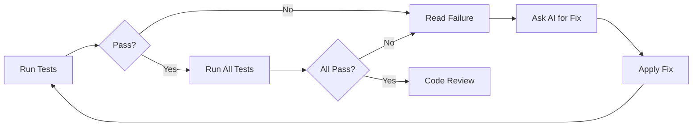

# Test-First AI Development Workflow

## The Complete Workflow

### Step 1: Test Creation (You + Claude/Opus)
**Where**: This chat
**What**: Create comprehensive test files that define expected behavior
**Output**: Complete test file like `test_pm009_project_support.py`

### Step 2: Initial Implementation (You + Sonnet)
**Where**: Your coding chat with Sonnet
**What**: Give Sonnet the tests and ask it to implement
**Prompt Template**:
```
I have a test file that defines the behavior for PM-009 multi-project support. 

Please:
1. Read all tests carefully
2. Identify what needs to be implemented
3. Check existing codebase patterns (use grep)
4. Implement minimal code to make tests pass

Important patterns to follow:
- Use IntegrationType enum from shared_types.py
- Domain logic goes in domain models
- Database operations only in repositories
- Check existing patterns before creating new ones

Here's the test file:
[PASTE TEST FILE]

Start by analyzing what exists and listing what needs to be created.
```

### Step 3: Incremental Development (Copilot/Cursor AI)
**Where**: Your code editor
**What**: Let AI complete specific functions while you run tests
**How**: Use test failures to guide what to implement next

### Step 4: Test-Fix Loop


## Choosing Implementation Formats

### JSON-Style Instructions

**Best For**: Copilot, Cursor, GitHub Copilot
**Why**: These tools excel at structured data and can generate boilerplate from schemas

**Pros**:
- Very clear structure for AI to follow
- Easy to validate completeness
- Natural for generating class skeletons
- Works well with autocomplete

**Cons**:
- Verbose for simple changes
- Can feel rigid for complex logic
- May encourage over-engineering

**Example Usage**:
```json
{
  "task": "Create ProjectContext class",
  "skeleton": {
    "class": "ProjectContext",
    "init_params": ["project_repo", "llm_client"],
    "methods": ["resolve_project", "_infer_project_from_context"]
  }
}
```

### Diff-Style Instructions

**Best For**: Claude, GPT-4, Sonnet (conversational AIs)
**Why**: These models understand context and can apply patches intelligently

**Pros**:
- Precise about where changes go
- Minimal, shows only what changes
- Great for updates to existing code
- Natural version control workflow

**Cons**:
- Requires correct context
- Can be fragile if code changed
- Harder for large additions

**Example Usage**:
```diff
# In shared_types.py after TaskStatus enum:
+ class IntegrationType(Enum):
+     GITHUB = "github"
+     JIRA = "jira"
```

### Natural Language Instructions

**Best For**: Complex logic, architectural decisions
**Why**: Allows AI to reason about approach

**Pros**:
- Flexible and adaptive
- Good for complex algorithms
- Allows AI creativity
- Easy to write

**Cons**:
- Can be ambiguous
- Results vary between runs
- Harder to validate completeness

**Example Usage**:
```
Implement the resolve_project method that follows this hierarchy:
1. Check explicit project_id first
2. Try to infer from message
3. Use last session project
4. Fall back to default
Handle ambiguous cases by returning needs_confirmation=True
```

## Format Selection Rubric

### Use JSON Format When:
- Creating new classes or modules
- You want consistent structure
- Working with strongly-typed languages
- AI needs clear boundaries

### Use Diff Format When:
- Making specific edits to existing code
- You know exact insertion points
- Changes are localized
- Maintaining code style is critical

### Use Natural Language When:
- Algorithm logic is complex
- You want AI to reason about approach
- Exploring different solutions
- Refactoring or optimizing

## Testing Your AI Tool's Preferences

### Quick Test Protocol
1. Give the same task in all three formats
2. Compare:
   - Speed of implementation
   - Accuracy to requirements
   - Code quality
   - How many iterations needed

### Quality Indicators

**Good AI Response**:
- Asks clarifying questions
- Checks existing patterns
- Implements incrementally
- Explains decisions

**Poor AI Response**:
- Dumps all code at once
- Ignores existing patterns
- Hardcodes values
- No error handling

## PM-009 Specific Workflow

### Session 1: Test Review (This Chat)
```
1. Review the PM-009 test file
2. Ensure tests cover your requirements
3. Add any missing test cases
4. Get final test file
```

### Session 2: Implementation (Sonnet Chat)
```
1. Share test file
2. Ask Sonnet to analyze what exists
3. Have it implement ProjectContext first
4. Then domain models
5. Then repository additions
6. Finally, workflow factory updates
```

### Session 3: Integration (Your Editor)
```
1. Run tests locally
2. Use Copilot to fill in missing methods
3. Fix test failures one by one
4. Ensure all tests pass
```

## Common Workflow Patterns

### Pattern 1: Test-Driven Skeleton
1. Write test
2. Generate class skeleton (JSON format)
3. Implement method by method (Natural language)
4. Fix edge cases (Diff format)

### Pattern 2: Iterative Refinement
1. Get working implementation (Natural language)
2. Run tests, identify failures
3. Apply specific fixes (Diff format)
4. Refactor for patterns (Natural language)

### Pattern 3: Parallel Development
1. You implement domain models
2. AI implements repositories
3. Both guided by same tests
4. Integrate and test together

## Success Metrics

### Good Session Indicators
- Tests start passing incrementally
- AI asks about existing patterns
- Code follows project conventions
- No hardcoded values

### Warning Signs
- All tests mysteriously pass at once
- Lots of mocking in production code
- Ignoring project architecture
- Creating duplicate functionality

## Tips for PM-009 Specifically

1. **Start with ProjectContext** - It's the core new component
2. **Reuse existing patterns** - Check how intent classification works
3. **Test the happy path first** - Get basic project resolution working
4. **Add edge cases gradually** - Ambiguous projects, missing integrations
5. **Integration test last** - Ensure it works with real workflow factory