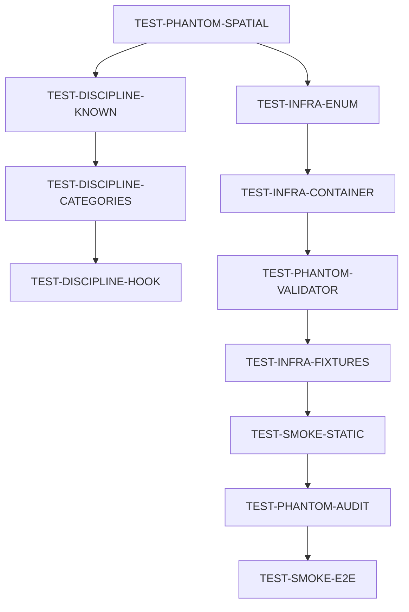

# GitHub Issues for TEST- Super Epic

## Super Epic
```markdown
Title: TEST- Test Infrastructure Repair
Labels: super-epic, test-infrastructure, p0-critical
Body:

## Overview
Complete test infrastructure overhaul discovered during alpha testing preparation. Test suite is ~40% fictional with phantom tests, missing infrastructure, and production code calling non-existent methods.

## Context
- 0 tests were discoverable (shadow package blocking)
- 617 tests found, only 422 passing (68.4%)
- ~195 failing/error tests blocking development
- Production calling non-existent methods (critical)

## Success Criteria
- [ ] All P0 issues resolved
- [ ] Test suite reaches 85% passing
- [ ] Pre-push hooks work reliably
- [ ] Known-failures workflow implemented
- [ ] Can push critical fixes without --no-verify

## Child Epics
- [ ] TEST-INFRA: Infrastructure & Collection
- [ ] TEST-PHANTOM: Phantom Code & Tests
- [ ] TEST-DISCIPLINE: Process & Workflow  
- [ ] TEST-SMOKE: Critical Path Coverage

Related: #piper-morgan-k6k (parent bead)
```

---

## P0 - CRITICAL Issues (Block Everything)

### Issue 1: TEST-PHANTOM-SPATIAL
```markdown
Title: Production calling 4 non-existent SlackSpatialMapper methods
Labels: bug, p0-critical, production-issue, test-infrastructure
Effort: Small-Medium
Body:

## Critical Issue
Production code (event_handler.py) calls 4 methods that don't exist in SlackSpatialMapper:
- map_message_to_spatial_object() - line 125
- map_reaction_to_emotional_marker() - line 169  
- map_mention_to_attention_attractor() - line 211
- map_channel_to_room() - line 255

## Mystery
Production is NOT crashing. Why?
- Hidden try/except blocks?
- Code paths never executed?
- __getattr__ magic methods?

## Required Investigation
1. Check for error suppression in event_handler.py
2. Add debug logging to verify execution
3. Search for methods in parent classes

## Gameplan
See: gameplan-TEST-PHANTOM-SPATIAL.md

## Success Criteria
- [ ] Root cause identified
- [ ] Appropriate fix implemented
- [ ] Tests verify fix
- [ ] No regression

Related beads: piper-morgan-1i5
```

### Issue 2: TEST-INFRA-ENUM  
```markdown
Title: Add 5 missing enum values causing 25+ test failures
Labels: bug, p0-critical, quick-win, test-infrastructure
Effort: Small (15 minutes)
Body:

## Quick Win
Add missing enum values that code already references:

### IntentCategory (services/shared_types.py)
- PLANNING = "planning"
- REVIEW = "review"

### AttentionLevel (services/integrations/slack/spatial_types.py)
- HIGH = "high"
- MEDIUM = "medium"  
- LOW = "low"

## Impact
- Fixes ~25 test failures immediately
- Unblocks test_workflow_integration.py (13 tests)
- Unblocks test_spatial_workflow_factory.py (9 tests)

## Evidence
Multiple test failures with `AttributeError: PLANNING`, `AttributeError: MEDIUM`

## Success Criteria
- [ ] 5 enum values added
- [ ] ~25 tests now passing
- [ ] No regression in existing tests
```

### Issue 3: TEST-DISCIPLINE-KNOWN
```markdown
Title: Implement known-failures workflow to unblock critical pushes
Labels: enhancement, p0-critical, test-infrastructure, developer-experience
Effort: Small-Medium
Body:

## Problem
Pre-push hook blocks on ANY test failure, including:
- Pre-existing failures
- TDD specs (expected to fail)
- Deferred work with beads

Cannot push critical fixes without --no-verify (dangerous)

## Solution
Implement .pytest-known-failures file:

```yaml
- test_path: "test_event_spatial_mapping.py"
  reason: "TDD - methods not implemented"
  bead: "piper-morgan-xyz"
  expires: "2025-12-01"
```

## Implementation
1. Create .pytest-known-failures file format
2. Update pre-push hook to check known failures
3. Add expiry date enforcement
4. Require bead reference for tracking

## Success Criteria
- [ ] Known-failures file format defined
- [ ] Pre-push hook updated
- [ ] Can push with known failures
- [ ] Expiry dates enforced
```

---

## P1 - URGENT Issues (This Week)

### Issue 4: TEST-DISCIPLINE-CATEGORIES
```markdown
Title: Add test categorization markers (TDD vs regression)
Labels: enhancement, p1-urgent, test-infrastructure
Effort: Medium
Body:

## Problem  
No distinction between:
- Unit tests (must pass)
- TDD specs (expected to fail)
- Integration tests (slower)
- Smoke tests (critical paths)

## Solution
Add pytest markers:
```python
@pytest.mark.unit        # Must pass
@pytest.mark.tdd_spec    # Expected to fail
@pytest.mark.integration # Uses real services
@pytest.mark.smoke       # Critical paths
```

## Implementation
1. Define markers in pytest.ini
2. Audit 617 tests and categorize
3. Update pre-push to skip TDD specs
4. Document in TESTING.md

## Success Criteria
- [ ] All 617 tests categorized
- [ ] Pre-push only blocks on real failures
- [ ] TDD specs clearly marked
```

### Issue 5: TEST-INFRA-CONTAINER
```markdown
Title: Fix OrchestrationEngine fixture (11 tests failing)
Labels: bug, p1-urgent, test-infrastructure
Effort: Small-Medium
Body:

## Problem
OrchestrationEngine tests fail with:
```
ContainerNotInitializedError: Container not initialized. Call container.initialize() first
```

## Solution Options
1. Mock container in fixture
2. Initialize container in fixture
3. Dependency injection refactor

## Affected Tests
All 11 tests in test_orchestration_engine.py

## Success Criteria
- [ ] Fixture initializes properly
- [ ] 11 tests passing
- [ ] No side effects on other tests
```

### Issue 6: TEST-DISCIPLINE-HOOK
```markdown
Title: Fix pre-push hook to handle test categories
Labels: enhancement, p1-urgent, developer-experience
Effort: Small
Body:

## Current Problem
Pre-push runs all tests, blocks on any failure

## Solution
Update pre-push hook:
```bash
# Only run non-TDD tests
pytest -m "not tdd_spec" tests/unit/
```

## Success Criteria
- [ ] Pre-push skips TDD specs
- [ ] Still blocks on real failures
- [ ] Integrates with known-failures
```

---

## P2 - HIGH Issues (Next Sprint)

### Issue 7: TEST-PHANTOM-VALIDATOR
```markdown
Title: Fix test_api_key_validator.py (44 phantom tests)
Labels: technical-debt, p2-high, test-infrastructure
Effort: Medium-Large
Body:

## Problem
368 lines of tests for API that was never implemented:
- Tests expect ValidationResult enum constants
- Tests expect module-level functions
- Reality has different class-based API

## Solution Options
1. Refactor tests to match implementation
2. Implement missing API layer
3. Remove phantom tests

## Related
Bead: piper-morgan-36m

## Success Criteria
- [ ] Tests match actual API
- [ ] 44 tests either pass or removed
- [ ] Documentation updated
```

### Issue 8: TEST-INFRA-FIXTURES
```markdown
Title: Fix async_transaction fixture pattern (53 tests)
Labels: bug, p2-high, test-infrastructure
Effort: Medium
Body:

## Problem
53 tests expect async_transaction fixture that doesn't exist

## Affected Files
- test_file_repository_migration.py (9 tests)
- test_file_resolver_edge_cases.py (5 tests)
- test_workflow_repository_migration.py (6 tests)
- Others...

## Solution
1. Create async_transaction fixture
2. OR refactor to use existing fixtures

## Success Criteria
- [ ] Fixture pattern established
- [ ] 53 tests can run
- [ ] Consistent across codebase
```

### Issue 9: TEST-SMOKE-STATIC
```markdown
Title: Add smoke tests for static file serving
Labels: enhancement, p2-high, test-coverage
Effort: Small
Body:

## Problem
No tests for critical infrastructure:
- Static file mounting broken (Saturday's issue)
- Template loading issues
- No smoke tests caught it

## Solution
Create smoke tests:
```python
def test_static_css_loads():
    response = client.get("/static/css/main.css")
    assert response.status_code == 200

def test_template_renders():
    response = client.get("/")
    assert "Piper Morgan" in response.text
```

## Success Criteria
- [ ] Static file test suite created
- [ ] Template loading verified
- [ ] Infrastructure issues caught early
```

---

## P3 - MEDIUM Issues (Backlog)

### Issue 10: TEST-PHANTOM-AUDIT
```markdown
Title: Full audit and cleanup of phantom tests
Labels: technical-debt, p3-medium, test-infrastructure
Effort: Large
Body:

## Scope
Complete audit of 617 tests to identify:
- Phantom tests (test non-existent features)
- Abandoned TDD specs
- Dead test code

## Process
1. Categorize all tests
2. Match tests to implementation
3. Remove or fix phantom tests
4. Document decisions

## Success Criteria
- [ ] All 617 tests audited
- [ ] Phantom tests removed/fixed
- [ ] Test-code parity achieved
```

### Issue 11: TEST-SMOKE-E2E
```markdown
Title: Create core user journey smoke tests
Labels: enhancement, p3-medium, test-coverage
Effort: Medium
Body:

## Scope
End-to-end tests for critical paths:
- User onboarding wizard
- Basic query processing
- Slack integration flow
- GitHub integration flow

## Success Criteria
- [ ] 10+ journey tests created
- [ ] Run in CI/CD
- [ ] Catch integration issues
```

---

## Dependencies



Priority: Follow P0 → P1 → P2 → P3 order
```
