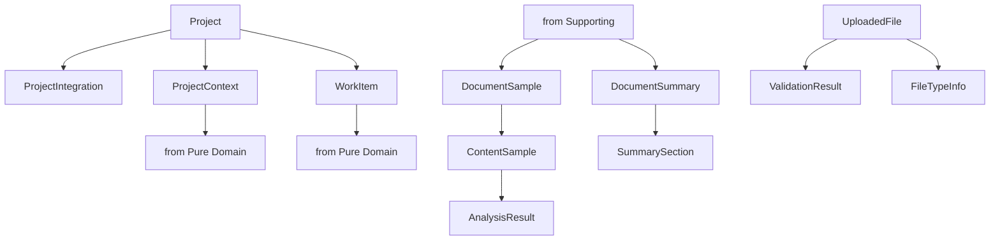

# Integration & Transfer Models

⚠️ **DDD Purity Warning**: Models in this layer handle external system contracts and data transfer. External dependencies expected but should be contained.

**Last Updated**: September 18, 2025
**Source**: `services/domain/models.py`
**Models**: 16 total (15 dataclass models + 1 enum)

## Overview

These models manage external system integration and data transfer operations. They handle contracts with external systems, file processing, document analysis, and work item synchronization while isolating external dependencies from the core domain.

**Architecture Rules**:
- ✅ External system contracts and DTOs
- ✅ Data transfer objects for integration
- ✅ File processing and validation models
- ✅ External dependencies contained to this layer
- ❌ NO complex business logic (belongs in domain)
- ❌ NO infrastructure concerns (belongs in infrastructure layer)

---

## Navigation

**By Business Function**:
- [Project Management](#project-management) - Project, ProjectIntegration, ProjectContext, WorkItem
- [Document Processing](#document-processing) - DocumentSample, ContentSample, AnalysisResult, SummarySection, DocumentSummary
- [File Management](#file-management) - UploadedFile, ValidationResult, FileTypeInfo
- [Analysis Types](#analysis-types) - AnalysisType

**All Models**: [Project](#project) | [ProjectIntegration](#projectintegration) | [ProjectContext](#projectcontext) | [WorkItem](#workitem) | [DocumentSample](#documentsample) | [ContentSample](#contentsample) | [AnalysisResult](#analysisresult) | [SummarySection](#summarysection) | [DocumentSummary](#documentsummary) | [UploadedFile](#uploadedfile) | [ValidationResult](#validationresult) | [FileTypeInfo](#filetypeinfo) | [AnalysisType](#analysistype)

---

## Project Management

### Project
**Purpose**: A project workspace with external tool integrations
**Layer**: Integration & Transfer Model
**Tags**: #pm #integration

**Field Structure**:
```python
# Identity fields
id: str                       # Unique identifier

# Core fields
name: str                     # Project name
description: str              # Project description
status: str                   # Project status

# Integration configuration
github_config: Optional[Dict[str, Any]] # GitHub integration settings
jira_config: Optional[Dict[str, Any]]   # Jira integration settings
slack_config: Optional[Dict[str, Any]]  # Slack integration settings

# Metadata fields
created_at: datetime          # Creation timestamp
updated_at: datetime          # Last modification

# Relationships
integrations: List["ProjectIntegration"] # Tool integrations
work_items: List["WorkItem"]  # Associated work items
contexts: List["ProjectContext"] # Workflow contexts
```

**Usage Pattern**:
```python
# Create project with integrations
project = Project(
    name="Authentication System v2",
    description="Upgrade user authentication with OAuth2",
    status="active",
    github_config={
        "repository": "company/auth-system",
        "default_branch": "main",
        "issue_labels": ["auth", "security", "backend"]
    },
    jira_config={
        "project_key": "AUTH",
        "issue_type": "Story",
        "default_assignee": "auth-team"
    }
)

# Add integrations
integration = ProjectIntegration(
    integration_type="github",
    configuration={"sync_enabled": True, "auto_pr": True}
)
project.integrations.append(integration)
```

**Cross-References**:
- Service: [ProjectService](../../services/project_service.md)
- Repository: [ProjectRepository](../../repositories/project_repository.md)
- Related: [Pure Domain Product](pure-domain.md#product)

### ProjectIntegration
**Purpose**: Configuration for external tool integration
**Layer**: Integration & Transfer Model
**Tags**: #pm #integration

**Field Structure**:
```python
# Identity fields
id: str                       # Unique identifier

# Core fields
project_id: str               # Parent project reference
integration_type: str         # Type of integration (github, jira, slack)
configuration: Dict[str, Any] # Integration-specific config

# Authentication
auth_config: Optional[Dict[str, Any]] # Authentication settings
api_endpoints: Optional[Dict[str, str]] # Custom endpoints

# Sync settings
sync_enabled: bool            # Sync enabled flag
sync_frequency: Optional[str] # Sync schedule
last_sync: Optional[datetime] # Last sync timestamp

# Status tracking
status: str                   # Integration status
error_message: Optional[str]  # Last error message

# Metadata fields
created_at: datetime          # Creation timestamp
updated_at: datetime          # Last modification
```

**Usage Pattern**:
```python
# Configure GitHub integration
github_integration = ProjectIntegration(
    project_id="proj-123",
    integration_type="github",
    configuration={
        "repository": "company/auth-system",
        "sync_issues": True,
        "sync_prs": True,
        "label_mapping": {
            "feature": "enhancement",
            "bug": "bug",
            "task": "task"
        }
    },
    auth_config={
        "token_type": "personal_access_token",
        "scopes": ["repo", "issues"]
    },
    sync_enabled=True,
    sync_frequency="hourly"
)

# Update sync status
github_integration.last_sync = datetime.now()
github_integration.status = "active"
```

**Cross-References**:
- Service: [IntegrationService](../../services/integration_service.md)
- Repository: [ProjectIntegrationRepository](../../repositories/project_integration_repository.md)
- External: GitHub API, Jira API, Slack API

### ProjectContext
**Purpose**: Context information for workflow execution within a project
**Layer**: Integration & Transfer Model
**Tags**: #pm #workflow

**Field Structure**:
```python
# Identity fields
id: str                       # Unique identifier

# Core fields
project_id: str               # Parent project reference
context_type: str             # Context type (feature, bug, task)
context_data: Dict[str, Any]  # Context information

# External references
github_issue_id: Optional[str] # GitHub issue reference
jira_ticket_id: Optional[str]  # Jira ticket reference
slack_channel_id: Optional[str] # Slack channel reference

# Workflow connection
workflow_id: Optional[str]    # Associated workflow
execution_context: Dict[str, Any] # Workflow execution data

# Status tracking
active: bool                  # Context active flag
priority: str                 # Context priority

# Metadata fields
created_at: datetime          # Creation timestamp
updated_at: datetime          # Last modification

# Relationships
project: Optional["Project"]  # Parent project
workflow: Optional["Workflow"] # Associated workflow
```

**Usage Pattern**:
```python
# Create workflow context
context = ProjectContext(
    project_id="proj-123",
    context_type="feature",
    context_data={
        "feature_name": "OAuth2 Integration",
        "stakeholders": ["auth-team", "security-team"],
        "requirements": ["RFC 6749 compliance", "JWT support"]
    },
    github_issue_id="456",
    jira_ticket_id="AUTH-789",
    execution_context={
        "phase": "analysis",
        "estimated_effort": "2 weeks",
        "dependencies": ["user-service", "token-service"]
    },
    priority="high"
)

# Update execution progress
context.execution_context["phase"] = "implementation"
context.updated_at = datetime.now()
```

**Cross-References**:
- Service: [ProjectContextService](../../services/project_context_service.md)
- Repository: [ProjectContextRepository](../../repositories/project_context_repository.md)
- Related: [Pure Domain Workflow](pure-domain.md#workflow)

### WorkItem
**Purpose**: Work item synchronized from external systems
**Layer**: Integration & Transfer Model
**Tags**: #pm #integration

**Field Structure**:
```python
# Identity fields
id: str                       # Unique identifier

# Core fields
title: str                    # Work item title
description: str              # Work item description
type: str                     # Type (bug, feature, task, improvement)
status: str                   # Current status (default: "open")
priority: str                 # Priority level (default: "medium")

# External system mapping
source_system: str            # Source system identifier
external_id: str              # External system ID
external_url: Optional[str]   # External system URL

# Assignment and tracking
assignee: Optional[str]       # Assigned person
labels: List[str]             # Work item labels
project_id: Optional[str]     # Parent project

# Additional fields
metadata: Dict[str, Any]      # Additional metadata
updated_at: Optional[datetime] # Last modification
feature_id: Optional[str]     # Associated feature
external_refs: Optional[Dict[str, Any]] # External references
product_id: Optional[str]     # Associated product
item_metadata: Optional[Dict[str, Any]] # Item metadata

# Metadata fields
created_at: datetime          # Creation timestamp

# Relationships
feature: Optional["Feature"]  # Associated feature
product: Optional["Product"]  # Associated product
```

**Usage Pattern**:
```python
# Sync GitHub issue as work item
work_item = WorkItem(
    title="Implement OAuth2 callback handling",
    description="Add callback endpoint for OAuth2 authorization flow",
    work_item_type="story",
    status="in_progress",
    priority="high",
    external_id="456",
    external_system="github",
    external_url="https://github.com/company/auth-system/issues/456",
    assignee="john.doe",
    reporter="jane.smith",
    labels=["auth", "backend", "security"],
    story_points=5,
    time_estimate="3 days",
    project_id="proj-123",
    sync_status="synced",
    external_updated_at=datetime.now()
)

# Update from external system
work_item.status = "completed"
work_item.time_spent = "2.5 days"
work_item.last_sync = datetime.now()
```

**Cross-References**:
- Service: [WorkItemService](../../services/work_item_service.md)
- Repository: [WorkItemRepository](../../repositories/work_item_repository.md)
- External: GitHub Issues, Jira Tickets, Linear Issues
- Related: [Pure Domain Feature](pure-domain.md#feature)

---

## Document Processing

### DocumentSample
**Purpose**: A sample of document content extracted for analysis
**Layer**: Integration & Transfer Model
**Tags**: #knowledge #files

**Field Structure**:
```python
# Identity fields
id: str                       # Unique identifier

# Core fields
document_id: str              # Source document reference
sample_type: str              # Type of sample (header, body, footer)
content: str                  # Sample content text
position: int                 # Position within document

# Extraction metadata
extraction_method: str        # How sample was extracted
confidence_score: float       # Extraction confidence (0-1)
character_count: int          # Sample character count
word_count: int               # Sample word count

# Analysis flags
contains_code: bool           # Contains code snippets
contains_tables: bool         # Contains table data
contains_links: bool          # Contains hyperlinks
language: Optional[str]       # Detected language

# Processing status
processed: bool               # Processing complete flag
analysis_complete: bool       # Analysis complete flag

# Metadata fields
created_at: datetime          # Creation timestamp

# Relationships
document: Optional["Document"] # Source document
```

**Usage Pattern**:
```python
# Extract document sample
sample = DocumentSample(
    document_id="doc-123",
    sample_type="header",
    content="# OAuth2 Implementation Guide\n\nThis document outlines...",
    position=0,
    extraction_method="markdown_parser",
    confidence_score=0.95,
    character_count=156,
    word_count=24,
    contains_code=False,
    contains_tables=False,
    contains_links=True,
    language="en",
    processed=True,
    analysis_complete=False
)

# Mark analysis complete
sample.analysis_complete = True
```

**Cross-References**:
- Service: [DocumentAnalysisService](../../services/document_analysis_service.md)
- Repository: [DocumentSampleRepository](../../repositories/document_sample_repository.md)
- Related: [Supporting Domain Document](supporting-domain.md#document)

### ContentSample
**Purpose**: Structured content sample for analysis processing
**Layer**: Integration & Transfer Model
**Tags**: #knowledge #analysis

**Field Structure**:
```python
# Identity fields
id: str                       # Unique identifier

# Core fields
content: str                  # Sample content
content_type: str             # Content type classification
source_context: Dict[str, Any] # Source context information

# Structure analysis
semantic_elements: List[str]  # Identified semantic elements
key_phrases: List[str]        # Extracted key phrases
entities: List[Dict[str, Any]] # Named entities

# Quality metrics
clarity_score: float          # Content clarity (0-1)
completeness_score: float     # Content completeness (0-1)
relevance_score: float        # Content relevance (0-1)

# Processing metadata
analysis_timestamp: datetime  # When analysis was performed
analysis_version: str         # Analysis algorithm version

# Metadata fields
created_at: datetime          # Creation timestamp
```

**Usage Pattern**:
```python
# Create content sample for analysis
sample = ContentSample(
    content="OAuth2 is an authorization framework that enables applications...",
    content_type="technical_explanation",
    source_context={
        "document_type": "guide",
        "section": "introduction",
        "audience": "developers"
    },
    semantic_elements=["definition", "use_case", "benefits"],
    key_phrases=["authorization framework", "secure access", "third-party applications"],
    entities=[
        {"text": "OAuth2", "type": "TECHNOLOGY", "confidence": 0.98},
        {"text": "RFC 6749", "type": "STANDARD", "confidence": 0.95}
    ],
    clarity_score=0.87,
    completeness_score=0.92,
    relevance_score=0.95,
    analysis_timestamp=datetime.now(),
    analysis_version="v2.1"
)
```

**Cross-References**:
- Service: [ContentAnalysisService](../../services/content_analysis_service.md)
- Repository: [ContentSampleRepository](../../repositories/content_sample_repository.md)

### AnalysisResult
**Purpose**: Result of content or document analysis
**Layer**: Integration & Transfer Model
**Tags**: #knowledge #analysis

**Field Structure**:
```python
# Identity fields
id: str                       # Unique identifier

# Core fields
analysis_type: str            # Type of analysis performed
subject_id: str               # ID of analyzed subject
result_data: Dict[str, Any]   # Analysis result data
summary: str                  # Analysis summary

# Quality and confidence
confidence_score: float       # Overall confidence (0-1)
quality_score: float          # Result quality (0-1)
completeness_indicator: float # Analysis completeness (0-1)

# Insights and findings
key_insights: List[str]       # Primary insights
recommendations: List[str]    # Recommendations
identified_issues: List[str]  # Issues found

# Processing metadata
analysis_duration_ms: int     # Processing time
analysis_model: str           # Analysis model used
analysis_parameters: Dict[str, Any] # Analysis configuration

# Validation
validated: bool               # Result validated flag
validation_notes: Optional[str] # Validation comments

# Metadata fields
created_at: datetime          # Creation timestamp
```

**Usage Pattern**:
```python
# Create analysis result
result = AnalysisResult(
    analysis_type="document_comprehension",
    subject_id="doc-123",
    result_data={
        "topics": ["authentication", "security", "API design"],
        "complexity_level": "intermediate",
        "technical_depth": "high",
        "code_examples": 12,
        "diagrams": 3
    },
    summary="Comprehensive OAuth2 implementation guide with practical examples",
    confidence_score=0.91,
    quality_score=0.88,
    completeness_indicator=0.95,
    key_insights=[
        "Covers complete OAuth2 flow implementation",
        "Includes security best practices",
        "Provides production-ready code examples"
    ],
    recommendations=[
        "Add error handling examples",
        "Include performance considerations",
        "Add testing strategies section"
    ],
    identified_issues=[
        "Missing PKCE extension documentation"
    ],
    analysis_duration_ms=2450,
    analysis_model="gpt-4",
    analysis_parameters={"temperature": 0.1, "max_tokens": 2000},
    validated=True
)
```

**Cross-References**:
- Service: [AnalysisService](../../services/analysis_service.md)
- Repository: [AnalysisResultRepository](../../repositories/analysis_result_repository.md)

### SummarySection
**Purpose**: A section within a document summary
**Layer**: Integration & Transfer Model
**Tags**: #knowledge #summary

**Field Structure**:
```python
# Identity fields
id: str                       # Unique identifier

# Core fields
summary_id: str               # Parent summary reference
section_title: str            # Section title
section_content: str          # Section content
section_order: int            # Order within summary

# Content metadata
section_type: str             # Section type (overview, details, conclusion)
key_points: List[str]         # Section key points
word_count: int               # Section word count

# Source tracking
source_sections: List[str]    # Original document sections
source_page_numbers: List[int] # Source page references

# Quality metrics
relevance_score: float        # Section relevance (0-1)
clarity_score: float          # Section clarity (0-1)

# Metadata fields
created_at: datetime          # Creation timestamp

# Relationships
summary: Optional["DocumentSummary"] # Parent summary
```

**Usage Pattern**:
```python
# Create summary section
section = SummarySection(
    summary_id="summary-456",
    section_title="OAuth2 Authorization Flow",
    section_content="OAuth2 defines a four-step authorization flow...",
    section_order=2,
    section_type="details",
    key_points=[
        "Four-step authorization process",
        "Secure token exchange",
        "Client authentication required"
    ],
    word_count=245,
    source_sections=["3.1", "3.2", "3.3"],
    source_page_numbers=[12, 13, 14],
    relevance_score=0.95,
    clarity_score=0.89
)
```

**Cross-References**:
- Service: [SummaryService](../../services/summary_service.md)
- Repository: [SummarySectionRepository](../../repositories/summary_section_repository.md)

### DocumentSummary
**Purpose**: A generated summary of a document
**Layer**: Integration & Transfer Model
**Tags**: #knowledge #summary

**Field Structure**:
```python
# Identity fields
id: str                       # Unique identifier

# Core fields
document_id: str              # Source document reference
summary_type: str             # Summary type (executive, technical, detailed)
title: str                    # Summary title
overview: str                 # Summary overview

# Content structure
total_sections: int           # Number of sections
total_word_count: int         # Total summary word count
estimated_reading_time: int   # Reading time in minutes

# Generation metadata
generation_model: str         # Model used for generation
generation_parameters: Dict[str, Any] # Generation configuration
generation_timestamp: datetime # When summary was generated

# Quality metrics
overall_quality_score: float  # Overall quality (0-1)
accuracy_score: float         # Accuracy assessment (0-1)
completeness_score: float     # Completeness assessment (0-1)

# Usage tracking
access_count: int             # Times accessed
last_accessed: Optional[datetime] # Last access time

# Validation
human_reviewed: bool          # Human review completed
review_notes: Optional[str]   # Review comments
approved: bool                # Summary approved flag

# Metadata fields
created_at: datetime          # Creation timestamp
updated_at: datetime          # Last modification

# Relationships
document: Optional["Document"] # Source document
sections: List["SummarySection"] # Summary sections
```

**Usage Pattern**:
```python
# Create document summary
summary = DocumentSummary(
    document_id="doc-123",
    summary_type="technical",
    title="OAuth2 Implementation Guide - Technical Summary",
    overview="Comprehensive guide covering OAuth2 implementation with security best practices and production examples",
    total_sections=5,
    total_word_count=1250,
    estimated_reading_time=6,
    generation_model="gpt-4",
    generation_parameters={
        "temperature": 0.2,
        "max_tokens": 2000,
        "summary_style": "technical"
    },
    generation_timestamp=datetime.now(),
    overall_quality_score=0.92,
    accuracy_score=0.95,
    completeness_score=0.88,
    access_count=0,
    human_reviewed=False,
    approved=False
)

# Add sections
section1 = SummarySection(section_title="Introduction", section_order=1)
summary.sections.append(section1)

# Mark as reviewed
summary.human_reviewed = True
summary.approved = True
summary.review_notes = "High quality summary, accurate technical content"
```

**Cross-References**:
- Service: [DocumentSummaryService](../../services/document_summary_service.md)
- Repository: [DocumentSummaryRepository](../../repositories/document_summary_repository.md)
- Related: [Supporting Domain Document](supporting-domain.md#document)

---

## File Management

### UploadedFile
**Purpose**: A file uploaded to the system
**Layer**: Integration & Transfer Model
**Tags**: #files #integration

**Field Structure**:
```python
# Identity fields
id: str                       # Unique identifier

# Core fields
session_id: str               # Upload session identifier
filename: str                 # Original filename
file_type: str                # MIME type
file_size: int                # File size in bytes
storage_path: str             # Storage path

# Upload metadata
upload_time: datetime         # Upload timestamp
last_referenced: Optional[datetime] # Last access time
reference_count: int          # Reference count
metadata: Dict[str, Any]      # Additional metadata
file_metadata: Dict[str, Any] # File-specific metadata

# Note: Only core fields from source model shown
```

**Usage Pattern**:
```python
# Create uploaded file record
uploaded_file = UploadedFile(
    filename="oauth2_guide.pdf",
    file_size=1024000,
    mime_type="application/pdf",
    file_hash="sha256:abc123def456...",
    storage_path="/uploads/2025/09/18/oauth2_guide.pdf",
    storage_backend="local_filesystem",
    accessible=True,
    uploader_id="user-789",
    upload_source="web",
    processing_status="pending",
    validation_complete=False,
    analysis_complete=False,
    contains_sensitive_data=False,
    access_level="team",
    retention_policy="2_years"
)

# Update processing status
uploaded_file.processing_status = "completed"
uploaded_file.validation_complete = True
uploaded_file.virus_scan_clean = True
```

**Cross-References**:
- Service: [FileUploadService](../../services/file_upload_service.md)
- Repository: [UploadedFileRepository](../../repositories/uploaded_file_repository.md)
- Storage: File storage backends

### ValidationResult
**Purpose**: Result of file validation process
**Layer**: Integration & Transfer Model
**Tags**: #files #validation

**Field Structure**:
```python
# Identity fields
id: str                       # Unique identifier

# Core fields
file_id: str                  # Validated file reference
validation_type: str          # Type of validation performed
valid: bool                   # Validation result
error_message: Optional[str]  # Error message if invalid

# Validation details
rules_checked: List[str]      # Validation rules applied
warnings: List[str]           # Validation warnings
recommendations: List[str]    # Improvement recommendations

# Security validation
malware_detected: bool        # Malware detection result
suspicious_content: bool      # Suspicious content flag
file_integrity_ok: bool       # File integrity check

# Content validation
content_type_valid: bool      # Content type validation
structure_valid: bool         # File structure validation
encoding_valid: bool          # File encoding validation

# Performance metrics
validation_duration_ms: int   # Validation time
validator_version: str        # Validator version used

# Metadata fields
created_at: datetime          # Validation timestamp

# Relationships
file: Optional["UploadedFile"] # Validated file
```

**Usage Pattern**:
```python
# Create validation result
validation = ValidationResult(
    file_id="file-456",
    validation_type="comprehensive",
    valid=True,
    rules_checked=[
        "file_size_limit",
        "mime_type_whitelist",
        "malware_scan",
        "content_structure"
    ],
    warnings=[
        "Large file size may impact processing time"
    ],
    recommendations=[
        "Consider compressing images for better performance"
    ],
    malware_detected=False,
    suspicious_content=False,
    file_integrity_ok=True,
    content_type_valid=True,
    structure_valid=True,
    encoding_valid=True,
    validation_duration_ms=850,
    validator_version="v3.2.1"
)

# Handle validation failure
if not validation.valid:
    validation.error_message = "File exceeds maximum size limit"
```

**Cross-References**:
- Service: [FileValidationService](../../services/file_validation_service.md)
- Repository: [ValidationResultRepository](../../repositories/validation_result_repository.md)

### FileTypeInfo
**Purpose**: Information about detected file type and characteristics
**Layer**: Integration & Transfer Model
**Tags**: #files #detection

**Field Structure**:
```python
# Identity fields
id: str                       # Unique identifier

# Core fields
file_id: str                  # Analyzed file reference
detected_type: str            # Detected file type
confidence_score: float       # Detection confidence (0-1)
mime_type: str                # Detected MIME type

# Format details
file_format: str              # Specific format (e.g., PDF/A, DOCX)
format_version: Optional[str] # Format version
compression_type: Optional[str] # Compression method

# Content characteristics
text_extractable: bool        # Text can be extracted
image_extractable: bool       # Images can be extracted
metadata_available: bool      # Metadata available
searchable: bool              # Content searchable

# Processing capabilities
can_preview: bool             # Preview generation possible
can_convert: bool             # Format conversion possible
requires_special_handling: bool # Special processing needed

# Security assessment
potentially_executable: bool  # Executable content flag
embedded_objects: bool        # Contains embedded objects
external_references: bool     # Contains external references

# Detection metadata
detection_method: str         # Detection method used
detection_timestamp: datetime # When detection was performed
detector_version: str         # Detector version

# Metadata fields
created_at: datetime          # Creation timestamp

# Relationships
file: Optional["UploadedFile"] # Analyzed file
```

**Usage Pattern**:
```python
# Create file type info
type_info = FileTypeInfo(
    file_id="file-456",
    detected_type="PDF",
    confidence_score=0.98,
    mime_type="application/pdf",
    file_format="PDF/A-1b",
    format_version="1.7",
    compression_type="flate",
    text_extractable=True,
    image_extractable=True,
    metadata_available=True,
    searchable=True,
    can_preview=True,
    can_convert=True,
    requires_special_handling=False,
    potentially_executable=False,
    embedded_objects=True,
    external_references=False,
    detection_method="magic_bytes_and_structure",
    detection_timestamp=datetime.now(),
    detector_version="v2.8.1"
)

# Check processing capabilities
if type_info.text_extractable and type_info.searchable:
    # Can process for content analysis
    pass
```

**Cross-References**:
- Service: [FileTypeDetectionService](../../services/file_type_detection_service.md)
- Repository: [FileTypeInfoRepository](../../repositories/file_type_info_repository.md)

---

## Analysis Types

### AnalysisType
**Purpose**: Enum defining types of analysis that can be performed
**Layer**: Integration & Transfer Model
**Tags**: #analysis #enum

**Enum Values**:
```python
class AnalysisType(Enum):
    DATA = "data"         # Data file analysis
    DOCUMENT = "document" # Document content analysis
    TEXT = "text"         # Text content analysis
    UNKNOWN = "unknown"   # Unknown or undetermined type
```

**Usage Pattern**:
```python
# Use in analysis results
analysis_result = AnalysisResult(
    file_id="file-123",
    analysis_type=AnalysisType.DOCUMENT,
    summary="Document contains technical specifications",
    key_findings=["API documentation", "Code examples"],
    metadata={"document_type": "technical"},
    recommendations=["Review security implications"],
    generated_at=datetime.now()
)

# Type checking in analysis logic
if analysis_result.analysis_type == AnalysisType.DOCUMENT:
    # Handle document-specific analysis
    pass
elif analysis_result.analysis_type == AnalysisType.DATA:
    # Handle data file analysis
    pass
```

**Cross-References**:
- Used by: [AnalysisResult](#analysisresult)
- Source: `services/domain/models.py:438-443`
- Related: File analysis pipeline, content type detection

---

## Model Relationships



---

## Architecture Patterns

### External System Contracts
These models define clear contracts with external systems:

- **Project Models**: GitHub, Jira, Slack integration contracts
- **WorkItem**: Standardized work item representation across tools
- **File Models**: File upload and processing contracts

### Data Transfer Objects
Models designed for data transfer between systems:

- **DocumentSample/ContentSample**: Analysis pipeline data flow
- **AnalysisResult**: Structured analysis output
- **ValidationResult**: File validation status transfer

### Integration Boundaries
Clear separation of external dependencies:

- External API configurations contained in integration models
- Authentication and sync logic isolated
- Error handling and status tracking included

---

## Usage Guidelines

### For Developers
1. **Isolate external dependencies** - Keep external system logic in integration layer
2. **Use DTOs for data transfer** - Don't pass domain models to external systems
3. **Handle external failures gracefully** - Include status and error tracking
4. **Validate external data** - Don't trust external system data integrity

### For Architects
1. **Review external contracts** - Ensure integration models properly isolate external concerns
2. **Monitor dependency creep** - Prevent external dependencies from leaking to domain
3. **Plan for integration failures** - Design resilient integration patterns
4. **Consider data synchronization** - Plan for eventual consistency with external systems

---

## Related Documentation

- **[Hub Navigation](../models-architecture.md)** - Return to main navigation
- **[Pure Domain Models](pure-domain.md)** - Core business concepts
- **[Supporting Domain Models](supporting-domain.md)** - Business with data structures
- **[Infrastructure Models](infrastructure.md)** - System mechanisms
- **[Dependency Diagrams](../dependency-diagrams.md)** - Visual model relationships

---

**Status**: ✅ **CURRENT** - All integration models documented with complete field definitions and external system context
