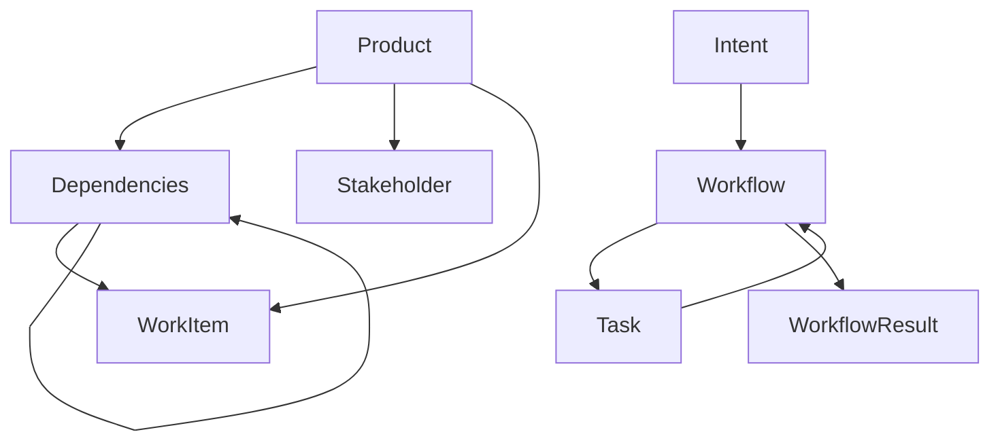

# Pure Domain Models

⚠️ **DDD Purity Warning**: Models in this layer must have NO infrastructure dependencies, NO database concerns, and NO external system references. These represent pure business concepts and rules.

**Last Updated**: September 18, 2025
**Source**: `services/domain/models.py`
**Models**: 8 total

## Overview

These models form the core business domain of Piper Morgan, representing fundamental concepts without any technical implementation details. They embody business logic, rules, and relationships in their purest form.

**Architecture Rules**:
- ✅ Business logic and domain rules
- ✅ Rich domain behaviors
- ✅ Entity relationships
- ❌ NO database imports
- ❌ NO infrastructure concerns
- ❌ NO external system dependencies

---

## Navigation

**By Business Function**:
- [Product Management](#product-management) - Product, Feature, Stakeholder
- [Workflow Orchestration](#workflow-orchestration) - Intent, Task, Workflow, WorkflowResult
- [Ethics & Safety](#ethics--safety) - EthicalDecision, BoundaryViolation

**All Models**: [Product](#product) | [Feature](#feature) | [Stakeholder](#stakeholder) | [Intent](#intent) | [Task](#task) | [Workflow](#workflow) | [WorkflowResult](#workflowresult) | [EthicalDecision](#ethicaldecision) | [BoundaryViolation](#boundaryviolation)

---

## Product Management

### Product
**Purpose**: A product being managed
**Layer**: Pure Domain Model
**Tags**: #pm

**Field Structure**:
```python
# Identity fields
id: str                       # Unique identifier

# Core fields
name: str                     # Product name
vision: str                   # Product vision statement
strategy: str                 # Strategic approach

# Metadata fields
created_at: datetime          # Creation timestamp
updated_at: datetime          # Last modification

# Relationships
features: List["Feature"]     # Product features
stakeholders: List["Stakeholder"]  # Product stakeholders
metrics: List["Metric"]       # Product metrics
work_items: List["WorkItem"]  # Associated work items
```

**Relationships**:
- `features`: List of Feature entities defining capabilities (one-to-many)
- `stakeholders`: People with interest in the product (one-to-many)
- `metrics`: Performance and success metrics (one-to-many)
- `work_items`: Development work items (one-to-many)

**Usage Pattern**:
```python
# Create product with vision
product = Product(
    name="Piper Morgan",
    vision="AI-powered PM assistant that automates routine tasks",
    strategy="Focus on developer productivity and autonomous execution"
)

# Add features
feature = Feature(name="Intent Classification", hypothesis="...")
product.features.append(feature)

# Connect stakeholders
stakeholder = Stakeholder(name="Engineering Team", role="Developer")
product.stakeholders.append(stakeholder)
```

**Cross-References**:
- Service: ProductService (planned)
- Repository: ProductRepository (planned)
- Database: [ProductDB schema](../data-model.md#productdb)

### Feature
**Purpose**: A feature or capability
**Layer**: Pure Domain Model
**Tags**: #pm

**Field Structure**:
```python
# Identity fields
id: str                       # Unique identifier

# Core fields
name: str                     # Feature name
description: str              # Detailed description
hypothesis: str               # Business hypothesis
acceptance_criteria: List[str] # Acceptance criteria
status: str                   # Development status
product_id: Optional[str]     # Parent product reference

# Metadata fields
created_at: datetime          # Creation timestamp
updated_at: datetime          # Last modification

# Relationships
dependencies: List["Feature"] # Feature dependencies
risks: List["Risk"]           # Associated risks
work_items: List["WorkItem"]  # Implementation work items
```

**Relationships**:
- `dependencies`: Other features this feature depends on (many-to-many)
- `risks`: Risk entities associated with this feature (one-to-many)
- `work_items`: Work items implementing this feature (one-to-many)

**Usage Pattern**:
```python
# Create feature with hypothesis
feature = Feature(
    name="Natural Language Intent Detection",
    description="Parse user messages to understand intent",
    hypothesis="Users will prefer natural language over form-based input",
    acceptance_criteria=[
        "Detect intent with >90% accuracy",
        "Process requests in <200ms",
        "Handle ambiguous requests gracefully"
    ]
)

# Add dependencies
prerequisite = Feature(name="Core NLP Pipeline")
feature.dependencies.append(prerequisite)
```

**Cross-References**:
- Service: FeatureService (planned)
- Repository: FeatureRepository (planned)
- Database: [FeatureDB schema](../data-model.md#featuredb)

### Stakeholder
**Purpose**: Someone with interest in the product
**Layer**: Pure Domain Model
**Tags**: #pm

**Field Structure**:
```python
# Identity fields
id: str                       # Unique identifier

# Core fields
name: str                     # Stakeholder name
email: Optional[str]          # Contact email
role: str                     # Role or title
interests: List[str]          # Areas of interest
influence_level: int           # 1-5 scale
satisfaction: Optional[float] # Current satisfaction level

# Metadata fields
created_at: datetime          # Creation timestamp
```

**Usage Pattern**:
```python
# Create stakeholder
stakeholder = Stakeholder(
    name="Sarah Chen",
    email="sarah@company.com",
    role="Engineering Manager",
    interests=["Developer Experience", "API Performance"],
    influence_level=5,
    satisfaction=0.8
)
```

**Cross-References**:
- Service: StakeholderService (planned)
- Repository: StakeholderRepository (planned)

---

## Workflow Orchestration

### Intent
**Purpose**: User intent parsed from natural language
**Layer**: Pure Domain Model
**Tags**: #workflow #ai

**Field Structure**:
```python
# Identity fields
id: str                       # Unique identifier

# Core fields
category: IntentCategory      # Classified intent category
action: str                   # Intended action
context: Dict[str, Any]       # Context information
confidence: float             # Classification confidence (0-1)
original_message: str         # Original user message

# Workflow connection
workflow_id: Optional[str]    # Associated workflow

# Metadata fields
created_at: datetime          # Creation timestamp

# Relationships
workflow: Optional["Workflow"] # Associated workflow execution
```

**Relationships**:
- `workflow`: Optional connection to Workflow (one-to-one)

**Usage Pattern**:
```python
# Create intent from user message
intent = Intent(
    category=IntentCategory.TASK_MANAGEMENT,
    action="create_feature",
    original_message="Can you help me create a new feature for user authentication?",
    context={"domain": "authentication", "type": "feature"},
    confidence=0.94
)

# Connect to workflow
workflow = Workflow(type=WorkflowType.FEATURE_CREATION)
intent.workflow = workflow
```

**Cross-References**:
- Service: [IntentService](../../services/intent_service.md)
- Repository: [IntentRepository](../../repositories/intent_repository.md)
- Enum: [IntentCategory](../../services/shared_types.py)

### Task
**Purpose**: Individual task within a workflow
**Layer**: Pure Domain Model
**Tags**: #workflow

**Field Structure**:
```python
# Identity fields
id: str                       # Unique identifier

# Core fields
name: str                     # Task name
type: TaskType                # Task type classification
status: TaskStatus            # Current status
result: Optional[Dict[str, Any]] # Task result data
error: Optional[str]          # Error message if failed

# Execution tracking
input_data: Optional[Dict[str, Any]]  # Input parameters
output_data: Optional[Dict[str, Any]] # Output results
started_at: Optional[datetime]        # Start time
completed_at: Optional[datetime]      # Completion time
workflow_id: Optional[str]            # Parent workflow

# Metadata fields
created_at: datetime          # Creation timestamp
updated_at: Optional[datetime] # Last modification

# Relationships
workflow: Optional["Workflow"] # Parent workflow
```

**Relationships**:
- `workflow`: Parent workflow containing this task (many-to-one)

**Usage Pattern**:
```python
# Create task for workflow
task = Task(
    name="Analyze Requirements",
    type=TaskType.ANALYZE_REQUEST,
    status=TaskStatus.PENDING,
    input_data={"user_request": "Create authentication feature"}
)

# Execute task
task.started_at = datetime.now()
task.status = TaskStatus.IN_PROGRESS

# Complete task
task.output_data = {"requirements": ["OAuth2 support", "JWT tokens"]}
task.completed_at = datetime.now()
task.status = TaskStatus.COMPLETED
```

**Cross-References**:
- Service: TaskService (planned)
- Repository: TaskRepository (planned)
- Enum: [TaskType, TaskStatus](../../services/shared_types.py)

### Workflow
**Purpose**: A workflow definition and execution state
**Layer**: Pure Domain Model
**Tags**: #workflow

**Field Structure**:
```python
# Identity fields
id: str                       # Unique identifier

# Core fields
type: WorkflowType            # Workflow type
status: WorkflowStatus        # Execution status
tasks: List[Task]             # Workflow tasks
context: Dict[str, Any]       # Execution context
result: Optional[WorkflowResult] # Final result
error: Optional[str]          # Error message if failed

# Execution tracking
input_data: Optional[Dict[str, Any]]  # Initial input
output_data: Optional[Dict[str, Any]] # Final output
started_at: Optional[datetime]        # Start time
completed_at: Optional[datetime]      # Completion time
intent_id: Optional[str]             # Triggering intent

# Metadata fields
created_at: datetime          # Creation timestamp
updated_at: datetime          # Last modification

# Relationships
intent: Optional["Intent"]    # Triggering intent
```

**Relationships**:
- `intent`: Optional connection to triggering Intent (one-to-one)
- `tasks`: List of tasks in this workflow (one-to-many)
- `result`: Optional workflow result (one-to-one)

**Usage Pattern**:
```python
# Create workflow
workflow = Workflow(
    type=WorkflowType.FEATURE_CREATION,
    status=WorkflowStatus.PENDING,
    context={"product_id": "prod-123"}
)

# Add tasks
workflow.tasks.extend([
    Task(name="Analyze Requirements", type=TaskType.ANALYZE_REQUEST),
    Task(name="Create Feature Draft", type=TaskType.CREATE_FEATURE),
    Task(name="Generate Work Items", type=TaskType.CREATE_WORK_ITEMS)
])

# Execute workflow
workflow.started_at = datetime.now()
workflow.status = WorkflowStatus.IN_PROGRESS
```

**Cross-References**:
- Service: [workflows.py](../../services/orchestration/workflows.py)
- Repository: [workflow_repository_legacy_removed.py](../../services/repositories/workflow_repository_legacy_removed.py)
- Enum: [WorkflowType, WorkflowStatus](../../services/shared_types.py)

### WorkflowResult
**Purpose**: Result of workflow execution
**Layer**: Pure Domain Model
**Tags**: #workflow

**Field Structure**:
```python
# Identity fields
id: str                       # Unique identifier

# Core fields
workflow_id: str              # Parent workflow reference
success: bool                 # Execution success flag
output_data: Dict[str, Any]   # Result data
execution_time: Optional[float] # Execution duration in seconds

# Metadata fields
created_at: datetime          # Creation timestamp
```

**Usage Pattern**:
```python
# Create workflow result
result = WorkflowResult(
    workflow_id=workflow.id,
    success=True,
    output_data={
        "feature_id": "feat-456",
        "work_items_created": 5,
        "estimated_effort": "3 weeks"
    },
    execution_time=45.2
)

# Associate with workflow
workflow.result = result
```

**Cross-References**:
- Service: [WorkflowService](../../services/workflow_service.md)
- Repository: [WorkflowRepository](../../repositories/workflow_repository.md)

---

## Ethics & Safety

### EthicalDecision
**Purpose**: A recorded ethical decision with rationale
**Layer**: Pure Domain Model
**Tags**: #ethics

**Field Structure**:
```python
# Identity fields
id: str                       # Unique identifier

# Core fields
decision_point: str           # What decision was needed
context: Dict[str, Any]       # Decision context
rationale: str                # Reasoning behind decision
decision: str                 # The actual decision made
ethical_framework: str        # Framework used for decision
stakeholder_impact: List[str] # Who is affected

# Review tracking
created_at: datetime          # When decision was made
reviewed_at: Optional[datetime] # When decision was reviewed
review_outcome: Optional[str] # Review result
```

**Usage Pattern**:
```python
# Record ethical decision
decision = EthicalDecision(
    decision_point="User data retention policy",
    context={"user_request": "delete all my data", "retention_policy": "30 days"},
    rationale="User explicitly requested deletion, GDPR compliance required",
    decision="Immediate deletion of all user data",
    ethical_framework="Rights-based ethics with regulatory compliance",
    stakeholder_impact=["User (positive)", "Engineering (implementation effort)"]
)
```

**Cross-References**:
- Service: [EthicsService](../../services/ethics_service.md)
- ADR: [ADR-014 Attribution First](../adr/adr-014-attribution-first.md)

### BoundaryViolation
**Purpose**: A detected boundary violation event
**Layer**: Pure Domain Model
**Tags**: #ethics #safety

**Field Structure**:
```python
# Identity fields
id: str                       # Unique identifier

# Core fields
boundary_type: str            # Type of boundary violated
violation_context: Dict[str, Any] # Context of violation
severity: str                 # Violation severity level
detected_at: datetime         # When violation was detected
prevented_action: str         # What action was prevented

# Resolution tracking
resolved_at: Optional[datetime] # When violation was resolved
resolution_action: Optional[str] # How it was resolved
```

**Usage Pattern**:
```python
# Record boundary violation
violation = BoundaryViolation(
    boundary_type="data_access",
    violation_context={
        "attempted_action": "access_user_data",
        "user_id": "user-789",
        "requester": "unauthorized_service"
    },
    severity="high",
    prevented_action="Blocked unauthorized access to user personal data"
)

# Mark as resolved
violation.resolved_at = datetime.now()
violation.resolution_action = "Updated service permissions, notified security team"
```

**Cross-References**:
- Service: [SafetyService](../../services/safety_service.md)
- ADR: [ADR-014 Attribution First](../adr/adr-014-attribution-first.md)

---

## Model Relationships



---

## Usage Guidelines

### For Developers
1. **Import only domain types** - Never import database or infrastructure classes
2. **Focus on business logic** - Implement domain rules and validation
3. **Use rich domain models** - Add methods for business operations
4. **Maintain relationships** - Use proper relationship management

### For Architects
1. **Preserve purity** - Ensure no infrastructure dependencies creep in
2. **Review relationships** - Validate domain model connections make business sense
3. **Consider aggregates** - Group related entities into consistent boundaries

---

## Related Documentation

- **[Hub Navigation](../models-architecture.md)** - Return to main navigation
- **[Supporting Domain Models](supporting-domain.md)** - Business with data structures
- **[Integration Models](integration.md)** - External system contracts
- **[Infrastructure Models](infrastructure.md)** - System mechanisms
- **[Dependency Diagrams](../dependency-diagrams.md)** - Visual model relationships

---

**Status**: ✅ **CURRENT** - All pure domain models documented with complete field definitions
