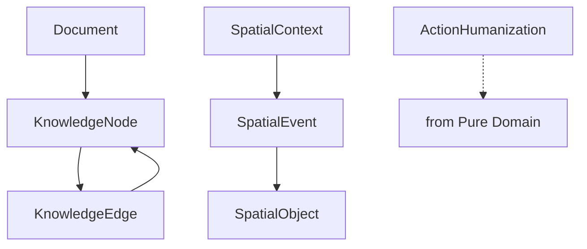

# Supporting Domain Models

⚠️ **DDD Purity Warning**: Models in this layer represent business concepts but require data structures, complex state, or specialized methods. Minimal infrastructure acceptable.

**Last Updated**: September 18, 2025
**Source**: `services/domain/models.py`
**Models**: 7 total

## Overview

These models support business capabilities by combining domain logic with necessary data structures. They represent business concepts that need complex state management, specialized algorithms, or data-intensive operations while maintaining business focus.

**Architecture Rules**:
- ✅ Business concepts and logic
- ✅ Data structures for business needs
- ✅ Specialized business methods
- ✅ Minimal infrastructure (when required for business logic)
- ❌ NO unnecessary technical complexity
- ❌ NO external system dependencies beyond business needs

---

## Navigation

**By Business Function**:
- [Knowledge Management](#knowledge-management) - Document, KnowledgeNode, KnowledgeEdge
- [Spatial Intelligence](#spatial-intelligence) - SpatialEvent, SpatialObject, SpatialContext
- [AI Enhancement](#ai-enhancement) - ActionHumanization

**All Models**: [Document](#document) | [KnowledgeNode](#knowledgenode) | [KnowledgeEdge](#knowledgeedge) | [SpatialEvent](#spatialevent) | [SpatialObject](#spatialobject) | [SpatialContext](#spatialcontext) | [ActionHumanization](#actionhumanization)

---

## Knowledge Management

### Document
**Purpose**: Core document entity for document memory system
**Layer**: Supporting Domain Model
**Tags**: #knowledge #documents

**Field Structure**:
```python
# Identity fields
id: str                       # Unique identifier

# Core fields
title: str                    # Document title
content: str                  # Document content
document_type: str            # Document classification
tags: List[str]               # Categorization tags
topics: List[str]             # Subject topics
decisions: List[str]          # Decisions recorded

# File metadata
file_path: Optional[str]      # Source file path
file_size: Optional[int]      # File size in bytes
mime_type: Optional[str]      # MIME type

# Analysis results
summary: str                  # Document summary
key_findings: List[str]       # Important findings
analysis_metadata: Dict[str, Any] # Analysis data

# Metadata fields
created_at: datetime          # Creation timestamp
updated_at: datetime          # Last modification
last_accessed: datetime       # Last access time
```

**Methods**:
```python
def to_dict(self) -> Dict[str, Any]:
    """Convert to dictionary for serialization"""
    return {
        "id": self.id,
        "title": self.title,
        "content": self.content,
        # ... all fields
    }
```

**Usage Pattern**:
```python
# Create document with analysis
document = Document(
    title="Product Requirements Document",
    content="...",
    document_type="requirements",
    tags=["product", "features", "auth"],
    topics=["authentication", "user management"],
    summary="Requirements for user authentication system",
    key_findings=[
        "OAuth2 integration required",
        "Multi-factor authentication needed",
        "Role-based permissions essential"
    ]
)

# Serialize for storage
doc_data = document.to_dict()
```

**Cross-References**:
- Service: [DocumentService](../../services/document_service.md)
- Repository: [DocumentRepository](../../repositories/document_repository.md)
- Processing: [DocumentProcessor](../../services/document_processor.md)

### KnowledgeNode
**Purpose**: A node in the knowledge graph representing a concept or entity
**Layer**: Supporting Domain Model
**Tags**: #knowledge #graph

**Field Structure**:
```python
# Identity fields
id: str                       # Unique identifier

# Core fields
node_type: NodeType           # Node classification
content: str                  # Node content/description
metadata: Dict[str, Any]      # Node metadata
embedding: Optional[List[float]] # Vector embedding
tags: List[str]               # Classification tags

# Graph properties
confidence_score: float       # Confidence in node accuracy
access_level: str             # Access permissions
version: int                  # Node version

# Source tracking
source_document_id: Optional[str] # Source document

# Usage tracking
last_accessed: Optional[datetime] # Last access time
access_count: int             # Access frequency

# Metadata fields
created_at: datetime          # Creation timestamp
updated_at: datetime          # Last modification
```

**Usage Pattern**:
```python
# Create knowledge node
node = KnowledgeNode(
    node_type=NodeType.CONCEPT,
    content="OAuth2 Authentication Protocol",
    metadata={
        "definition": "Industry standard protocol for authorization",
        "use_cases": ["API access", "Single sign-on", "Third-party integration"]
    },
    tags=["authentication", "security", "protocol"],
    confidence_score=0.95,
    source_document_id="doc-requirements-123"
)

# Update access tracking
node.last_accessed = datetime.now()
node.access_count += 1
```

**Cross-References**:
- Service: [KnowledgeGraphService](../../services/knowledge_graph_service.md)
- Repository: [KnowledgeNodeRepository](../../repositories/knowledge_node_repository.md)
- Enum: [NodeType](../../services/shared_types.py)

### KnowledgeEdge
**Purpose**: An edge in the knowledge graph representing a relationship
**Layer**: Supporting Domain Model
**Tags**: #knowledge #graph

**Field Structure**:
```python
# Identity fields
id: str                       # Unique identifier

# Graph structure
source_node_id: str           # Source node reference
target_node_id: str           # Target node reference
edge_type: EdgeType           # Relationship type
weight: float                 # Relationship strength
confidence: float             # Confidence in relationship

# Edge properties
metadata: Dict[str, Any]      # Relationship metadata

# Strength tracking
last_strengthened: Optional[datetime] # Last reinforcement
strength_count: int           # Times relationship was reinforced

# Metadata fields
created_at: datetime          # Creation timestamp
```

**Usage Pattern**:
```python
# Create knowledge relationship
edge = KnowledgeEdge(
    source_node_id="node-oauth2",
    target_node_id="node-jwt-tokens",
    edge_type=EdgeType.IMPLEMENTS,
    weight=0.8,
    confidence=0.9,
    metadata={
        "relationship_description": "OAuth2 uses JWT tokens for authorization",
        "evidence_sources": ["RFC 6749", "RFC 7519"]
    }
)

# Strengthen relationship
edge.last_strengthened = datetime.now()
edge.strength_count += 1
edge.weight = min(1.0, edge.weight + 0.1)
```

**Cross-References**:
- Service: [KnowledgeGraphService](../../services/knowledge_graph_service.md)
- Repository: [KnowledgeEdgeRepository](../../repositories/knowledge_edge_repository.md)
- Enum: [EdgeType](../../services/shared_types.py)

---

## Spatial Intelligence

### SpatialEvent
**Purpose**: Spatial event within the spatial metaphor system
**Layer**: Supporting Domain Model
**Tags**: #spatial #events

**Field Structure**:
```python
# Identity fields
id: str                       # Unique identifier

# Core fields
event_type: str               # Type of spatial event
significance_level: str       # routine, notable, significant, critical

# Spatial coordinates (integer positioning)
territory_position: int       # Territory coordinate
room_position: int            # Room coordinate
path_position: Optional[int]  # Path coordinate
object_position: Optional[int] # Object coordinate

# Event details
actor_id: Optional[str]       # Who triggered the event
affected_objects: List[str]   # Objects affected by event
spatial_changes: Dict[str, Any] # Changes to spatial state

# Timing
event_time: Optional[datetime] # When event occurred
```

**Methods**:
```python
def get_spatial_coordinates(self) -> Dict[str, Optional[int]]:
    """Get complete spatial coordinate set"""
    return {
        "territory": self.territory_position,
        "room": self.room_position,
        "path": self.path_position,
        "object": self.object_position
    }
```

**Usage Pattern**:
```python
# Create spatial event
event = SpatialEvent(
    event_type="user_navigation",
    territory_position=1,
    room_position=3,
    path_position=2,
    actor_id="user-123",
    significance_level="routine",
    spatial_changes={
        "previous_room": 2,
        "navigation_method": "direct",
        "objects_encountered": ["obj-45", "obj-67"]
    }
)

# Get coordinates for spatial operations
coords = event.get_spatial_coordinates()
print(f"Event at T{coords['territory']}:R{coords['room']}")
```

**Cross-References**:
- Service: [SpatialService](../../services/spatial_service.md)
- Repository: [SpatialEventRepository](../../repositories/spatial_event_repository.md)
- ADR: [ADR-013 MCP Spatial Integration](../adr/adr-013-mcp-spatial-integration-pattern.md)

### SpatialObject
**Purpose**: An object placed within the spatial metaphor system
**Layer**: Supporting Domain Model
**Tags**: #spatial #objects

**Field Structure**:
```python
# Identity fields
id: str                       # Unique identifier

# Core fields
object_type: str              # Type of spatial object
object_subtype: Optional[str] # Subtype classification
properties: Dict[str, Any]    # Object properties
active: bool                  # Object active state

# Spatial coordinates (integer positioning)
territory_position: int       # Territory coordinate
room_position: int            # Room coordinate
path_position: Optional[int]  # Path coordinate
object_position: Optional[int] # Object coordinate

# Ownership and access
creator_id: Optional[str]     # Who created the object
access_restrictions: List[str] # Access limitations

# Interaction tracking
last_interaction: Optional[datetime] # Last interaction time
interaction_count: int        # Interaction frequency

# System metadata
metadata: Dict[str, Any]      # System metadata
created_at: datetime          # Creation timestamp
updated_at: datetime          # Last modification
```

**Methods**:
```python
def get_spatial_coordinates(self) -> Dict[str, Optional[int]]:
    """Get complete spatial coordinate set"""
    return {
        "territory": self.territory_position,
        "room": self.room_position,
        "path": self.path_position,
        "object": self.object_position
    }
```

**Usage Pattern**:
```python
# Create spatial object
obj = SpatialObject(
    object_type="document",
    object_subtype="requirements",
    territory_position=1,
    room_position=5,
    object_position=1,
    properties={
        "title": "Authentication Requirements",
        "size": "large",
        "visibility": "public"
    },
    creator_id="user-456",
    access_restrictions=["team_only"]
)

# Track interaction
obj.last_interaction = datetime.now()
obj.interaction_count += 1

# Get location for spatial queries
coords = obj.get_spatial_coordinates()
```

**Cross-References**:
- Service: [SpatialService](../../services/spatial_service.md)
- Repository: [SpatialObjectRepository](../../repositories/spatial_object_repository.md)
- ADR: [ADR-017 Spatial MCP](../adr/adr-017-spatial-mcp.md)

### SpatialContext
**Purpose**: Context information for spatial metaphor navigation
**Layer**: Supporting Domain Model
**Tags**: #spatial #context

**Field Structure**:
```python
# Identity fields
id: str                       # Unique identifier

# Session tracking
session_id: str               # Session identifier

# Current position
current_territory: int        # Current territory
current_room: int             # Current room
current_path: Optional[int]   # Current path

# Context data
context_data: Dict[str, Any]  # Session context
navigation_history: List[Dict[str, Any]] # Navigation trail

# Metadata fields
created_at: datetime          # Creation timestamp
last_updated: datetime        # Last modification
```

**Usage Pattern**:
```python
# Create spatial context
context = SpatialContext(
    session_id="session-789",
    current_territory=1,
    current_room=3,
    current_path=1,
    context_data={
        "user_id": "user-123",
        "session_type": "exploration",
        "objectives": ["find_documentation", "understand_architecture"]
    },
    navigation_history=[
        {"territory": 1, "room": 1, "timestamp": "2025-09-18T09:00:00Z"},
        {"territory": 1, "room": 2, "timestamp": "2025-09-18T09:05:00Z"},
        {"territory": 1, "room": 3, "timestamp": "2025-09-18T09:10:00Z"}
    ]
)

# Update position
context.current_room = 4
context.last_updated = datetime.now()
context.navigation_history.append({
    "territory": 1,
    "room": 4,
    "timestamp": datetime.now().isoformat()
})
```

**Cross-References**:
- Service: [SpatialContextService](../../services/spatial_context_service.md)
- Repository: [SpatialContextRepository](../../repositories/spatial_context_repository.md)

---

## AI Enhancement

### ActionHumanization
**Purpose**: Result of humanizing an action description
**Layer**: Supporting Domain Model
**Tags**: #ai #enhancement

**Field Structure**:
```python
# Identity fields
id: str                       # Unique identifier

# Core fields
original_action: str          # Raw action description
humanized_action: str         # Human-friendly version
context: Dict[str, Any]       # Humanization context
confidence_score: float       # Quality confidence (0-1)

# Processing metadata
processing_time_ms: Optional[int] # Processing duration

# Metadata fields
created_at: datetime          # Creation timestamp
```

**Usage Pattern**:
```python
# Humanize technical action
humanization = ActionHumanization(
    original_action="execute_workflow_task_type_ANALYZE_REQUEST_with_context_data",
    humanized_action="Analyzing your request to understand what you need",
    context={
        "task_type": "ANALYZE_REQUEST",
        "user_intent": "feature_creation",
        "complexity": "moderate"
    },
    confidence_score=0.89,
    processing_time_ms=45
)

# Use humanized version for user display
print(f"Status: {humanization.humanized_action}")
```

**Cross-References**:
- Service: [ActionHumanizationService](../../services/action_humanization_service.md)
- Repository: [ActionHumanizationRepository](../../repositories/action_humanization_repository.md)
- ADR: [ADR-004 Action Humanizer Integration](../adr/adr-004-action-humanizer-integration.md)

---

## Model Relationships



---

## Architecture Patterns

### Data Structures for Business Logic
These models demonstrate how business concepts can require sophisticated data structures:

- **Document**: Rich metadata and analysis results for knowledge management
- **KnowledgeNode/Edge**: Graph structures for relationship modeling
- **Spatial Models**: Coordinate systems for spatial intelligence
- **ActionHumanization**: AI processing results with confidence scoring

### Business Methods
Several models include specialized business methods:

- **Document.to_dict()**: Business serialization logic
- **SpatialEvent/Object.get_spatial_coordinates()**: Business coordinate operations

### Minimal Infrastructure
These models use minimal infrastructure only when required for business logic:

- Vector embeddings for knowledge graphs
- Coordinate systems for spatial metaphors
- Confidence scoring for AI enhancement
- Performance tracking for optimization

---

## Usage Guidelines

### For Developers
1. **Focus on business value** - Use data structures to solve business problems
2. **Minimize infrastructure** - Only add technical complexity when business-justified
3. **Document business methods** - Explain why specialized methods are needed
4. **Maintain business focus** - Don't let data structures obscure domain logic

### For Architects
1. **Validate business need** - Ensure data complexity serves business purposes
2. **Review infrastructure usage** - Keep minimal and business-focused
3. **Consider aggregates** - Group related models with similar complexity levels
4. **Monitor boundary creep** - Prevent technical concerns from dominating

---

## Related Documentation

- **[Hub Navigation](../models-architecture.md)** - Return to main navigation
- **[Pure Domain Models](pure-domain.md)** - Core business concepts
- **[Integration Models](integration.md)** - External system contracts
- **[Infrastructure Models](infrastructure.md)** - System mechanisms
- **[Dependency Diagrams](../dependency-diagrams.md)** - Visual model relationships

---

**Status**: ✅ **CURRENT** - All supporting domain models documented with complete field definitions and business context
