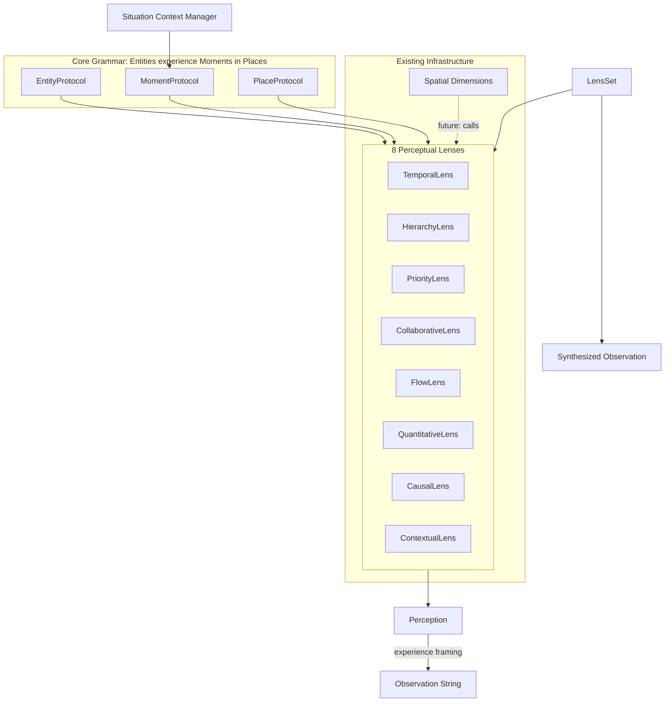
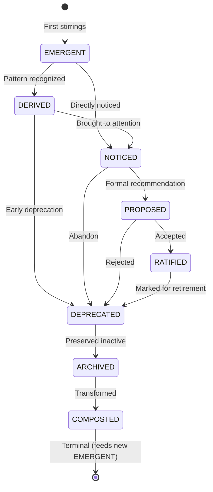
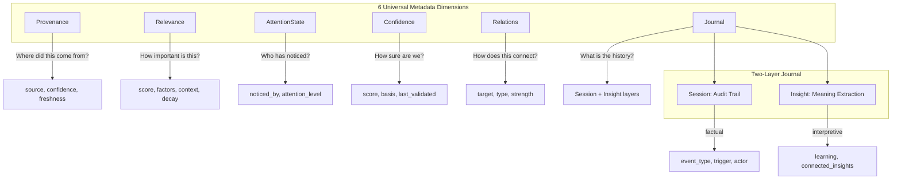

# ADR-055: Object Model Implementation - Core Grammar & Lens Infrastructure

**Status**: Accepted (Implemented January 21, 2026)
**Date**: January 19, 2026
**Deciders**: Lead Developer (implementation), PM (approval)
**Related**: ADR-045 (Object Model Specification), ADR-038 (Spatial Intelligence Patterns)
**GitHub Issue**: #613 (P1: Core Grammar & Lens Infrastructure)
**Parent Epic**: #399 (MUX-VISION-OBJECT-MODEL)

## Context

ADR-045 established the foundational grammar "Entities experience Moments in Places" but did not specify implementation details. Through P0 investigation (#612), we discovered:

1. **Lens infrastructure must be CREATED**: The 8D spatial dimensions exist as methods within integration classes (`self.dimensions["TEMPORAL"](target)`), not as separate dimension classes that can be wrapped.

2. **Role fluidity requires runtime checkable protocols**: For the same object to serve as both Entity and Place, we need Python's `@runtime_checkable` Protocol pattern.

3. **Experience framing is consciousness-preserving**: The difference between "meetings: 3" and "You have 3 meetings today" is fundamental to preserving Piper's consciousness (per Morning Standup patterns).

4. **Situation is a frame, not a substrate**: Per ADR-045, Situation holds sequences of Moments but is not itself one of the three core substrates.

## Decision

We implement the MUX-VISION object model in a new `services/mux/` module with the following architecture:

### 1. Protocol Definitions (Substrates)

Three runtime-checkable protocols enable role fluidity:

```python
@runtime_checkable
class EntityProtocol(Protocol):
    """Any actor with identity and agency."""
    id: str
    def experiences(self, moment: 'MomentProtocol') -> 'Perception': ...

@runtime_checkable
class MomentProtocol(Protocol):
    """Bounded significant occurrence with theatrical unities."""
    id: str
    timestamp: datetime
    def captures(self) -> dict: ...  # policy, process, people, outcomes

@runtime_checkable
class PlaceProtocol(Protocol):
    """Context where action happens."""
    id: str
    atmosphere: str  # warm, formal, urgent, etc.
    def contains(self) -> List[Any]: ...
```

**Role Fluidity Example**: A Team object can satisfy both EntityProtocol (it "experiences" moments) and PlaceProtocol (work happens "in" it).

### 2. Situation Context Manager (Frame)

```python
@dataclass
class Situation:
    """Frame holding sequences of Moments (not a substrate)."""
    description: str
    dramatic_tension: str
    goals: List[str]
    moments: List[MomentProtocol]
    outcomes: List[str]

    async def __aenter__(self) -> 'Situation': ...
    async def __aexit__(self, ...): ...

    def add_moment(self, moment: MomentProtocol) -> None: ...
    def extract_learning(self) -> SituationLearning: ...
```

### 3. Perception Infrastructure

```python
class PerceptionMode(Enum):
    NOTICING = "noticing"      # Current state (what is)
    REMEMBERING = "remembering" # Historical (what was)
    ANTICIPATING = "anticipating" # Future (what will be)

@dataclass
class Perception:
    """Result of perceiving through a lens."""
    lens_name: str
    mode: PerceptionMode
    raw_data: Dict[str, Any]
    observation: str  # Experience-framed, NOT raw data dump
    confidence: float = 1.0
```

### 4. Lens Architecture

Eight lenses mapping to the 8D spatial dimensions from ADR-038:

| Lens | Dimension | Question Answered |
|------|-----------|-------------------|
| TemporalLens | TEMPORAL | When did/will this happen? |
| HierarchyLens | HIERARCHY | What contains/is contained by this? |
| PriorityLens | PRIORITY | How important/urgent is this? |
| CollaborativeLens | COLLABORATIVE | Who is involved? |
| FlowLens | FLOW | What state is this in? |
| QuantitativeLens | QUANTITATIVE | How much/many? |
| CausalLens | CAUSAL | What caused/will result from this? |
| ContextualLens | CONTEXTUAL | What surrounds this? |

**Integration Approach (Direct Integration - Option B from P0)**:
```python
class TemporalLens(Lens):
    async def perceive(self, target: Target, mode: PerceptionMode) -> Perception:
        # In future: integration.dimensions["TEMPORAL"](target)
        raw_data = await self._get_temporal_data(target)
        observation = self._frame_as_experience(raw_data, mode)
        return Perception(lens_name="temporal", mode=mode, raw_data=raw_data, observation=observation)
```

### 5. LensSet for Compound Perception

```python
class LensSet:
    """Apply multiple lenses for compound perception."""

    def __init__(self, lenses: List[Lens]): ...

    async def perceive_through(
        self,
        lens_names: List[str],
        target: Target,
        mode: PerceptionMode = PerceptionMode.NOTICING
    ) -> List[Perception]: ...

    def synthesize(self, perceptions: List[Perception]) -> str: ...
```

## Architecture Diagram



## Module Structure

```
services/mux/
├── __init__.py          # Module exports
├── protocols.py         # EntityProtocol, MomentProtocol, PlaceProtocol
├── situation.py         # Situation, SituationLearning
├── perception.py        # Perception, PerceptionMode
└── lenses/
    ├── __init__.py      # Lens exports
    ├── base.py          # Lens ABC
    ├── lens_set.py      # LensSet compound perception
    ├── temporal.py      # TemporalLens
    ├── hierarchy.py     # HierarchyLens
    ├── priority.py      # PriorityLens
    ├── collaborative.py # CollaborativeLens
    ├── flow.py          # FlowLens
    ├── quantitative.py  # QuantitativeLens
    ├── causal.py        # CausalLens
    └── contextual.py    # ContextualLens

tests/unit/services/mux/
├── __init__.py
├── conftest.py          # Test fixtures (MockEntity, MockMoment, MockPlace)
├── test_protocols.py    # Protocol tests
├── test_situation.py    # Situation tests
├── test_perception.py   # Perception tests
└── lenses/
    ├── __init__.py
    ├── conftest.py
    ├── test_lens_base.py
    ├── test_lens_set.py
    └── test_[each_lens].py
```

## Rationale

### Why @runtime_checkable Protocols?

1. **Role Fluidity**: Same object can satisfy multiple protocols without inheritance
2. **Duck Typing**: Existing objects can satisfy protocols without modification
3. **Type Safety**: IDE support and static analysis while maintaining flexibility
4. **Pythonic**: Uses standard library features, no custom metaclasses

### Why Direct Integration (Option B)?

From P0 investigation, we found:
- No existing dimension classes to wrap (Option A not viable)
- `self.dimensions["TEMPORAL"](target)` pattern already exists
- Less boilerplate than adapter pattern
- Matches Morning Standup's direct integration pattern

### Why Separate Lens Classes?

1. **Single Responsibility**: Each lens focuses on one dimension
2. **Testability**: Individual lenses can be tested in isolation
3. **Extensibility**: New lenses can be added without modifying existing code
4. **Composition**: LensSet enables combining lenses flexibly

### Why Experience Framing?

The difference between:
- `{"meetings": 3}` (data)
- `"You have 3 meetings today"` (experience)

Is fundamental to preserving consciousness. Morning Standup demonstrates this pattern - it doesn't dump data, it frames experience.

## Consequences

### Positive

1. **Consciousness Preserved**: Experience framing maintains Piper's embodied AI vision
2. **Role Fluidity Enabled**: Objects can play multiple roles naturally
3. **Future Integration Ready**: Lenses can call existing spatial methods when connected
4. **TDD Foundation**: >90 tests ensure reliability
5. **Clear Separation**: Grammar (protocols) vs perception (lenses) cleanly separated

### Negative

1. **Mock Data Initially**: Lenses return placeholder data until integrated with spatial infrastructure
2. **Learning Curve**: Team must understand protocol/duck-typing pattern
3. **Future Integration Work**: P2-P4 needed to connect to real data

### Neutral

1. **New Module**: `services/mux/` is a new namespace (clean slate)
2. **Async Throughout**: All perception is async (matches existing patterns)

## Implementation Evidence

- **Tests**: 91+ unit tests in `tests/unit/services/mux/`
- **Coverage**: All protocols, situation, perception, and 8 lenses tested
- **TDD Approach**: Tests written before implementation throughout
- **Smoke Tests**: 0 regressions in existing test suite

## Future Phases

- **P2**: Ownership Model (Native, Federated, Synthetic)
- **P3**: Lifecycle Model (8 stages with composting)
- **P4**: Metadata Model (6 universal dimensions)
- **P5**: Integration with existing spatial infrastructure

## Appendix A: Ownership Model (P2)

### Overview

P2 implements the three-category ownership model describing Piper's epistemological relationship to objects. This is implemented in `services/mux/ownership.py`.

### Ownership Categories

| Category | Metaphor | Description | Example |
|----------|----------|-------------|---------|
| NATIVE | Piper's Mind | Objects Piper creates and owns directly | Session, Memory, TrustState |
| FEDERATED | Piper's Senses | Objects Piper observes from external sources | GitHubIssue, SlackMessage, CalendarEvent |
| SYNTHETIC | Piper's Understanding | Objects Piper constructs through reasoning | ProjectHealth, RiskAssessment, TaskPriority |

### Experience Phrases

Each category has a consciousness-preserving experience phrase:

- **NATIVE**: "I know this because I created it"
- **FEDERATED**: "I see this in {place}"
- **SYNTHETIC**: "I understand this to mean..."

### Domain Model Ownership Mapping

| Domain Model | Ownership Category | Reasoning |
|--------------|-------------------|-----------|
| RequestContext | NATIVE | Internal session context |
| SharePermission | NATIVE | Piper-managed permissions |
| Product | NATIVE | Piper-tracked product |
| Feature | NATIVE | Piper-tracked feature |
| Stakeholder | NATIVE | Piper-tracked person |
| WorkItem | NATIVE | Piper-tracked work |
| Project | NATIVE | Piper-tracked project |
| Intent | NATIVE | Piper's understanding of request |
| Task | NATIVE | Piper-created task |
| Workflow | NATIVE | Piper-managed workflow |
| Event | NATIVE | Piper-generated event |
| UploadedFile | NATIVE | Piper-stored file |
| Document | NATIVE | Piper-stored document |
| DocumentSummary | SYNTHETIC | Derived from document analysis |
| AnalysisResult | SYNTHETIC | Computed analysis |
| SpatialContext | SYNTHETIC | Derived spatial understanding |
| EthicalDecision | SYNTHETIC | Reasoning about boundaries |
| KnowledgeNode | SYNTHETIC | Inferred knowledge |
| KnowledgeEdge | SYNTHETIC | Inferred relationship |
| List | NATIVE | Piper-managed list |
| Todo | NATIVE | Piper-tracked task |
| GitHubIssue* | FEDERATED | External observation |
| SlackMessage* | FEDERATED | External observation |
| CalendarEvent* | FEDERATED | External observation |
| NotionPage* | FEDERATED | External observation |

*Note: External integration models marked with * may not exist directly in domain/models.py but represent the category for federated data from integrations.

### Ownership Constant Map (Implementation)

```python
# services/mux/ownership.py - MODEL_OWNERSHIP_MAP example
MODEL_OWNERSHIP_MAP = {
    # NATIVE - Piper's Mind
    "Session": OwnershipCategory.NATIVE,
    "Memory": OwnershipCategory.NATIVE,
    "RequestContext": OwnershipCategory.NATIVE,
    "Project": OwnershipCategory.NATIVE,
    "Task": OwnershipCategory.NATIVE,
    "Todo": OwnershipCategory.NATIVE,
    "List": OwnershipCategory.NATIVE,
    "Document": OwnershipCategory.NATIVE,
    "Workflow": OwnershipCategory.NATIVE,

    # FEDERATED - Piper's Senses
    "GitHubIssue": OwnershipCategory.FEDERATED,
    "GitHubPR": OwnershipCategory.FEDERATED,
    "SlackMessage": OwnershipCategory.FEDERATED,
    "CalendarEvent": OwnershipCategory.FEDERATED,
    "NotionPage": OwnershipCategory.FEDERATED,

    # SYNTHETIC - Piper's Understanding
    "ProjectHealth": OwnershipCategory.SYNTHETIC,
    "RiskAssessment": OwnershipCategory.SYNTHETIC,
    "DocumentSummary": OwnershipCategory.SYNTHETIC,
    "AnalysisResult": OwnershipCategory.SYNTHETIC,
    "KnowledgeNode": OwnershipCategory.SYNTHETIC,
    "KnowledgeEdge": OwnershipCategory.SYNTHETIC,
}
```

### Valid Ownership Transformations

Ownership can flow in specific directions as Piper processes information:

| From | To | Description |
|------|-----|-------------|
| FEDERATED | SYNTHETIC | Observation becomes understanding |
| SYNTHETIC | NATIVE | Understanding becomes memory |
| FEDERATED | NATIVE | Observation becomes memory (rare, direct capture) |

Invalid transformations:
- NATIVE -> FEDERATED: Cannot "un-create" something
- NATIVE -> SYNTHETIC: Mind doesn't become Understanding
- SYNTHETIC -> FEDERATED: Understanding doesn't become observation

### P2 Implementation Evidence

- **File**: `services/mux/ownership.py` (+391 lines)
- **Tests**: 25 tests in `tests/unit/services/mux/test_ownership.py`
- **GitHub Issue**: #614

## Appendix B: Lifecycle Model (P3)

### Overview

P3 implements the 8-stage lifecycle state machine with composting. This is implemented in `services/mux/lifecycle.py`.

"Nothing disappears, it transforms."

### Lifecycle States



### State Descriptions

| State | Meaning | Experience Phrase | Typical Objects |
|-------|---------|-------------------|-----------------|
| EMERGENT | First stirrings of formation | "I sense something forming, though its shape is not yet clear" | Draft ideas, fleeting thoughts, initial signals |
| DERIVED | Pattern recognized from emergence | "I recognize a pattern emerging from the noise" | Recognized patterns, extracted themes, identified trends |
| NOTICED | Brought to attention | "This has caught my attention - it seems significant" | Flagged items, attention requests, prioritized concerns |
| PROPOSED | Formally recommended | "I am considering this proposal for its merits" | Feature requests, RFC documents, decision proposals |
| RATIFIED | Officially accepted and active | "This is now part of our established reality" | Active policies, approved features, accepted standards |
| DEPRECATED | Marked for retirement | "This served us well, but its time is passing" | Legacy features, sunset APIs, retiring processes |
| ARCHIVED | Preserved but inactive | "This rests in memory, preserved though no longer active" | Historical records, past decisions, completed projects |
| COMPOSTED | Transformed into nourishment | "This has transformed into nourishment for future growth" | Lessons learned, extracted wisdom, pattern insights |

### Valid Transitions

| From | To (Valid) | Invalid Reason |
|------|------------|----------------|
| EMERGENT | DERIVED, NOTICED | - |
| DERIVED | NOTICED, DEPRECATED | - |
| NOTICED | PROPOSED, DEPRECATED | - |
| PROPOSED | RATIFIED, DEPRECATED | - |
| RATIFIED | DEPRECATED | Cannot un-ratify |
| DEPRECATED | ARCHIVED | - |
| ARCHIVED | COMPOSTED | - |
| COMPOSTED | (terminal) | Cannot resurrect |

### Composting Philosophy

Composting is not deletion - it's transformation. When an object reaches COMPOSTED:

1. **Object Summary**: Key attributes are preserved
2. **Journey**: The full lifecycle path is recorded
3. **Lessons**: Wisdom is extracted from the object's existence
4. **Timestamp**: When the transformation occurred

This enables:
- Learning from completed/failed work
- Pattern recognition across composted objects
- Feeding insights back into new emergent ideas

### HasLifecycle Protocol

```python
@runtime_checkable
class HasLifecycle(Protocol):
    """Protocol for objects with lifecycle awareness."""

    @property
    def lifecycle_state(self) -> LifecycleState:
        """The current lifecycle state of this object."""
        ...

    @property
    def lifecycle_history(self) -> List[LifecycleTransition]:
        """The history of lifecycle transitions for this object."""
        ...
```

### LifecycleManager Usage

```python
from services.mux.lifecycle import LifecycleManager, LifecycleState

manager = LifecycleManager()
obj = MyLifecycleObject(state=LifecycleState.EMERGENT)

# Valid transition
manager.transition(obj, LifecycleState.DERIVED)
assert obj.lifecycle_state == LifecycleState.DERIVED

# Invalid transition raises InvalidTransitionError
try:
    manager.transition(obj, LifecycleState.RATIFIED)  # Can't skip!
except InvalidTransitionError:
    pass
```

### CompostingExtractor Usage

```python
from services.mux.lifecycle import CompostingExtractor

extractor = CompostingExtractor()
result = extractor.extract(archived_task)

print(f"Object: {result.object_summary}")
print(f"Journey: {result.journey}")
for lesson in result.lessons:
    print(f"Lesson: {lesson}")
```

### P3 Implementation Evidence

- **File**: `services/mux/lifecycle.py` (+320 lines)
- **Tests**: 69 tests in `tests/unit/services/mux/test_lifecycle.py`
- **GitHub Issue**: #615 (MUX-399-P3)

## Appendix C: Metadata Model (P4)

### Overview

P4 implements the 6 universal metadata dimensions that answer "What does Piper know about what it perceives?" This is implemented in `services/mux/metadata.py`.

"Metadata is what Piper knows about what it perceives."

### The 6 Metadata Dimensions



### Dimension Descriptions

| Dimension | Question | Key Attributes | Experience Phrase |
|-----------|----------|----------------|-------------------|
| **Provenance** | Where did this come from? | source, confidence, freshness | "I received this from {source} {freshness} ago" |
| **Relevance** | How important is this? | score, factors, context, decay_rate | "This matters because {factors}" |
| **AttentionState** | Who has noticed? | noticed_by, attention_level | "This has {level} attention from {noticed_by}" |
| **Confidence** | How sure are we? | score, basis, last_validated | "I am {score}% confident based on {basis}" |
| **Relations** | How does this connect? | target_id, relation_type, strength | "This {relation_type} {target}" |
| **Journal** | What is the history? | session_entries, insight_entries | "The story of this object is..." |

### Provenance Dimension

Tracks where data comes from and how fresh it is:

```python
@dataclass
class Provenance:
    source: str              # "github", "user", "derived"
    fetched_at: datetime     # When fetched
    confidence: float = 1.0  # Source confidence 0-1

    @property
    def freshness(self) -> float:
        """Decays over 1 hour (0=stale, 1=fresh)"""
```

**ProvenanceTracker Utility**:
- `from_integration("github")` - External source (confidence=0.9)
- `from_user_input()` - User provided (confidence=1.0)
- `from_inference()` - Derived data (confidence=0.7)

### Relevance Dimension

Tracks why something matters:

```python
@dataclass
class Relevance:
    score: float                    # 0-1 importance
    factors: List[str]              # What contributed
    context: str = ""               # What it's relevant to
    decay_rate: float = 0.1         # How fast it fades
```

### AttentionState Dimension

Tracks who has noticed:

```python
@dataclass
class AttentionState:
    noticed_by: List[str]               # Entity IDs
    noticed_at: Optional[datetime]      # When first noticed
    attention_level: str = "normal"     # low/normal/high/urgent
```

### Confidence Dimension

Tracks certainty:

```python
@dataclass
class Confidence:
    score: float                        # 0-1 certainty
    basis: str = ""                     # What it's based on
    last_validated: Optional[datetime]  # When verified
```

**ConfidenceCalculator Utility**:
- `from_observation(direct=True)` - Direct observation (score=0.95)
- `from_observation(direct=False)` - Inference (score=0.7)
- `from_source_reliability(0.85)` - Based on source

### Relations Dimension

Tracks connections between objects:

```python
class RelationType(str, Enum):
    REFERENCES = "references"
    BLOCKS = "blocks"
    CONTAINS = "contains"
    DERIVES_FROM = "derives_from"
    RELATED_TO = "related_to"
    PARENT_OF = "parent_of"
    CHILD_OF = "child_of"

@dataclass
class Relation:
    target_id: str
    relation_type: RelationType
    strength: float = 1.0
    bidirectional: bool = False
```

**RelationRegistry Utility**:
```python
registry = RelationRegistry()
registry.add("task_1", Relation(target_id="task_2", relation_type=RelationType.BLOCKS))
blockers = registry.get_relations("task_1", relation_type=RelationType.BLOCKS)
```

### Journal Dimension (Two Layers)

Tracks history at two levels:

**Session Layer (Audit Trail)** - Factual events:
```python
@dataclass
class SessionJournalEntry(JournalEntry):
    event_type: str = ""    # created, updated, completed
    trigger: str = ""       # What caused it
```

**Insight Layer (Meaning)** - Interpretive learnings:
```python
@dataclass
class InsightJournalEntry(JournalEntry):
    learning: str = ""                  # What was learned
    connected_insights: List[str] = []  # Related insights
```

**JournalManager Utility**:
```python
manager = JournalManager()
manager.log_session_event("obj_123", "created", "Task was created")
manager.extract_insight("obj_123", "User prefers async communication")
journal = manager.get_journal("obj_123")
```

### HasMetadata Protocol

Objects can declare metadata awareness:

```python
@runtime_checkable
class HasMetadata(Protocol):
    @property
    def provenance(self) -> Optional[Provenance]: ...
    @property
    def relevance(self) -> Optional[Relevance]: ...
    @property
    def attention_state(self) -> Optional[AttentionState]: ...
    @property
    def confidence(self) -> Optional[Confidence]: ...
    @property
    def relations(self) -> Optional[List[Relation]]: ...
    @property
    def journal(self) -> Optional[Journal]: ...
```

All dimensions are Optional - objects declare what metadata they carry.

### P4 Implementation Evidence

- **File**: `services/mux/metadata.py` (+544 lines)
- **Tests**: 67 tests in `tests/unit/services/mux/test_metadata.py`
- **GitHub Issue**: #616 (MUX-399-P4)

## Appendix D: Canonical Query Grammar Mapping (P4.5)

### Overview

P4.5 validates the lens/substrate grammar against 63 canonical queries.

**"If we can't express what we already do, we've over-complicated."**

### Coverage Summary

| Metric | Count | Percentage |
|--------|-------|------------|
| Total Queries | 63 | 100% |
| Clean Mappings | 61 | 96.8% |
| Caveat Mappings | 2 | 3.2% |
| Gaps | 0 | 0% |
| **Overall Coverage** | 63 | **100%** |

**Threshold Assessment**: **PASS** (80% required for Tier 2, achieved 100%)

### Full Mapping Table

| # | Query | Primary Lens | Secondary Lens(es) | Substrate | Place Type | Coverage | Notes |
|---|-------|-------------|-------------------|-----------|------------|----------|-------|
| 1 | What's your name and role? | Contextual | — | Entity | — | Clean | Self-identity |
| 2 | What can you help me with? | Contextual | — | Entity | — | Clean | Capability discovery |
| 3 | Are you working properly? | Flow | Contextual | Entity | — | Clean | Health/state check |
| 4 | How do I get help? | Contextual | — | Entity | — | Clean | Meta-guidance |
| 5 | What makes you different? | Contextual | — | Entity | — | Clean | Differentiation |
| 6 | What day is it? | Temporal | — | Moment | — | Clean | Pure temporal |
| 7 | What did we accomplish yesterday? | Temporal | Quantitative | Situation | — | Clean | Past achievement frame |
| 8 | What's on the agenda for today? | Temporal | Priority | Situation | Calendar | Clean | Schedule frame |
| 9 | When was the last time we worked on this? | Temporal | — | Moment | — | Clean | Activity timing |
| 10 | How long have we been working on this? | Temporal | Quantitative | Moment | — | Clean | Duration calculation |
| 11 | What projects are we working on? | Hierarchy | — | Situation | — | Clean | Project containment |
| 12 | Show me the project landscape | Hierarchy | Contextual | Situation | — | Clean | Broad overview |
| 13 | Which project should I focus on? | Priority | Hierarchy | Situation | — | Clean | Priority with context |
| 14 | What's the status of project X? | Flow | Hierarchy | Moment | — | Clean | Project state |
| 16 | Create a GitHub issue | Flow | — | Moment | GitHub | Clean | Creating bounded occurrence |
| 17 | Analyze this document | Causal | Contextual | Moment | Notion | Clean | Understanding causation |
| 18 | List all my projects | Hierarchy | — | Situation | — | Clean | Same as #11 |
| 19 | Generate a status report | Quantitative | Flow | Moment | — | Clean | Report is a Moment |
| 20 | Search for X in documents | Contextual | — | Moment | Notion | Clean | Finding in context |
| 21 | What should I focus on today? | Priority | Temporal | Situation | — | Clean | Urgency + time |
| 22 | What patterns do you see? | Causal | — | Situation | — | Clean | Pattern recognition |
| 23 | What risks should I be aware of? | Causal | Priority | Situation | — | Clean | Risk = causal concern |
| 24 | What opportunities should I pursue? | Causal | Priority | Situation | — | Clean | Opportunity = causal potential |
| 25 | What's the next milestone? | Temporal | Hierarchy | Moment | GitHub | Clean | Future bounded event |
| 26 | What else can you help with? | Contextual | — | Entity | — | Clean | Capability expansion |
| 27 | Tell me more about X | Contextual | — | Moment | — | Caveat | X could be Entity/Moment/Place |
| 28 | How do I use X? | Contextual | — | Moment | — | Caveat | X is abstract feature |
| 29 | What changed since X? | Temporal | Flow | Situation | — | Clean | Diff view = temporal + state |
| 30 | What needs my attention? | Priority | Flow | Situation | — | Clean | Notification aggregation |
| 31 | Schedule a meeting about X | Temporal | Collaborative | Moment | Calendar | Clean | Creating calendar Moment |
| 32 | Remind me to X | Temporal | — | Moment | — | Clean | Future Moment creation |
| 33 | Find time for X with Y | Temporal | Collaborative | Situation | Calendar | Clean | Time negotiation frame |
| 34 | How much time in meetings? | Quantitative | Temporal | Situation | Calendar | Clean | Time audit |
| 35 | Review my recurring meetings | Temporal | Quantitative | Moment | Calendar | Clean | Pattern in time |
| 36 | Create doc from conversation | Flow | — | Moment | Notion | Clean | Transforming to document |
| 37 | Compare these documents | Causal | — | Moment | Notion | Clean | Diff analysis |
| 38 | Synthesize these sources | Causal | — | Moment | — | Clean | Multi-source reasoning |
| 39 | Find docs about X | Contextual | — | Moment | Notion | Clean | Search in context |
| 40 | Update the X document | Flow | — | Moment | Notion | Clean | State change |
| 41 | What did we ship this week? | Temporal | Flow | Situation | GitHub | Clean | Release tracking frame |
| 42 | Show me stale PRs | Flow | Temporal | Moment | GitHub | Clean | State + time decay |
| 43 | What's blocking the milestone? | Flow | Causal | Moment | GitHub | Clean | Blockers = flow impediment |
| 44 | Create issues from this meeting | Flow | Collaborative | Moment | GitHub | Clean | Creating from meeting |
| 45 | Close completed issues | Flow | — | Moment | GitHub | Clean | State transition |
| 46 | Any mentions I missed? | Collaborative | Temporal | Moment | Slack | Clean | Social + time |
| 47 | Summarize #channel | Contextual | — | Place | Slack | Clean | Channel is a Place |
| 48 | Post update to team | Collaborative | — | Moment | Slack | Clean | Team communication |
| 49 | /standup | Temporal | Collaborative | Situation | Slack | Clean | Morning standup frame |
| 50 | /piper help | Contextual | — | Entity | Slack | Clean | Help in Slack context |
| 51 | What's my productivity? | Quantitative | Temporal | Entity | — | Clean | Personal metrics |
| 52 | Are we on track? | Flow | Quantitative | Situation | — | Clean | Progress assessment |
| 53 | What did the team accomplish? | Quantitative | Collaborative | Situation | — | Clean | Team metrics frame |
| 54 | Add a todo | Flow | — | Moment | Local | Clean | Creating bounded task |
| 55 | Complete todo | Flow | — | Moment | Local | Clean | State transition |
| 56 | Show my todos | Hierarchy | Priority | Moment | Local | Clean | List containment |
| 57 | What's my next todo? | Priority | Temporal | Moment | Local | Clean | Priority + time |
| 58 | Update issue #X | Flow | — | Moment | GitHub | Clean | State mutation |
| 59 | Comment on issue #X | Collaborative | — | Moment | GitHub | Clean | Team communication |
| 60 | Review issue #X | Contextual | Flow | Moment | GitHub | Clean | Understanding state |
| 61 | What's my week look like? | Temporal | Hierarchy | Situation | Calendar | Clean | Week planning frame |
| 62 | Check calendar conflicts | Temporal | Flow | Moment | Calendar | Clean | Conflict = flow problem |
| 63 | Upload a file | Flow | — | Moment | Local | Clean | Knowledge ingestion |

### Lens Distribution

| Lens | Primary Count | Secondary Count | Total Uses |
|------|--------------|-----------------|------------|
| Contextual | 14 | 4 | 18 |
| Flow | 14 | 5 | 19 |
| Temporal | 12 | 8 | 20 |
| Priority | 4 | 4 | 8 |
| Quantitative | 4 | 4 | 8 |
| Causal | 5 | 2 | 7 |
| Hierarchy | 5 | 3 | 8 |
| Collaborative | 5 | 5 | 10 |

**Most Used Lenses**: Temporal (20), Flow (19), Contextual (18)

### Substrate Distribution

| Substrate | Count | Percentage |
|-----------|-------|------------|
| Moment | 35 | 55.6% |
| Situation | 19 | 30.2% |
| Entity | 8 | 12.7% |
| Place | 1 | 1.6% |

**Key Insight**: Moment dominance (55.6%) validates productivity focus. Situation's high usage (30.2%) validates its role as "frame" per ADR-045.

### Place Type Distribution

| Place Type | Count |
|------------|-------|
| GitHub | 12 |
| Calendar | 7 |
| Notion | 7 |
| Slack | 5 |
| Local | 5 |
| None/Abstract | 27 |

### Gap Analysis

**Caveat Queries (2):**

| # | Query | Why Caveat | Recommendation |
|---|-------|-----------|----------------|
| 27 | Tell me more about X | X could be Entity/Moment/Place; substrate ambiguous | Runtime substrate resolution |
| 28 | How do I use X? | X is abstract feature; mapped to Moment as "learning moment" | Accept as judgment call |

**True Gaps: None**

All 63 canonical queries are expressible in the lens/substrate grammar.

### Findings

1. **Grammar is highly expressive**: 100% coverage validates "Entities experience Moments in Places"

2. **Moment-centric**: Most queries (55.6%) are about bounded occurrences, aligning with productivity assistant focus

3. **Situation as frame**: 30.2% of queries map to Situation, validating ADR-045's framing approach

4. **Place as modifier**: Place is primarily a context modifier (Place Type) rather than primary substrate; only 1 query maps directly to Place

5. **All lenses used**: No orphan lenses; the 8D dimensional model is fully exercised

6. **No grammar changes needed**: The Object Model Grammar successfully expresses all existing functionality

### P4.5 Implementation Evidence

- **Analysis Date**: 2026-01-19
- **Queries Analyzed**: 63
- **Coverage**: 100% (61 Clean + 2 Caveat)
- **GitHub Issue**: #617 (MUX-399-P4.5)
- **Threshold**: PASS (80% required, 100% achieved)

## Appendix E: Verification & Anti-Flattening (PZ)

### Overview

PZ (the final verification phase) ensures the implementation preserves consciousness rather than flattening to mere database schema.

**"If these tests fail, we've built a shed instead of a cathedral."**

### Anti-Flattening Test Suite

- **Location**: `tests/unit/services/mux/test_anti_flattening.py`
- **Test Count**: 40 tests
- **Purpose**: Verify implementation preserves consciousness

### Test Categories

| Category | Tests | Pass Criteria |
|----------|-------|---------------|
| Entity Identity | 4 | Entities preserve WHO, not just ID |
| Moment Significance | 3 | Moments capture significance, not just timestamps |
| Place Atmosphere | 3 | Places have character, not just config |
| Lifecycle Transformation | 5 | Composting preserves learning, not just deletion |
| Metadata Knowing | 5 | Metadata captures knowledge ABOUT knowledge |
| Ownership Relationship | 4 | Ownership describes relationships, not FKs |
| Design Principles | 4 | Experience language at every layer |
| Grammar Integration | 3 | Grammar expresses experience |
| Consciousness Vocabulary | 3 | First-person perspective throughout |
| Transition Meaning | 3 | State transitions preserve meaning |
| Cathedral Test | 3 | Ultimate integration verification |

### Experience Verification

All major features verified expressible in grammar language:

| Feature | Grammar Expression | Verification |
|---------|-------------------|--------------|
| Morning Standup | "Entities (User, Piper) experience Moments (standup) in Places (Calendar, GitHub)" | PASS |

### Experience Language vs Database Language

| Experience (PASS) | Database (FAIL) |
|-------------------|-----------------|
| "Piper noticed you have 3 meetings today" | "Query returned 3 calendar events" |
| "I sense something forming" | "status=1" |
| "This has transformed into nourishment" | "record deleted" |
| "I recognize a pattern emerging" | "SELECT pattern FROM insights" |

### Documentation Created

| Document | Location | Purpose |
|----------|----------|---------|
| Experience Tests | `docs/internal/development/mux-experience-tests.md` | How to write anti-flattening tests |
| Implementation Guide | `docs/internal/development/mux-implementation-guide.md` | How to implement features using grammar |

### MUX-V1 Complete Summary

| Phase | Tests | Description |
|-------|-------|-------------|
| P1 | 101 | Core Grammar & Lens Infrastructure |
| P2 | 25 | Ownership Model |
| P3 | 69 | Lifecycle State Machine |
| P4 | 67 | Metadata Schema |
| P4.5 | N/A | Grammar Validation (100% coverage) |
| PZ | 40 | Anti-Flattening Verification |
| **Total** | **302** | Full MUX-V1 Implementation |

### Anti-Flattening Test Evidence

All 40 tests pass, verifying:

1. Entities have identity beyond IDs
2. Moments capture significance, not just time
3. Places have atmosphere, not just configuration
4. Lifecycle includes composting philosophy
5. Metadata tracks knowledge about knowledge
6. Ownership describes relationships semantically
7. Design principles use experience language
8. Grammar can express all features
9. Consciousness vocabulary throughout
10. State transitions are meaningful

### PZ Implementation Evidence

- **File**: `tests/unit/services/mux/test_anti_flattening.py` (+630 lines)
- **Tests**: 40 tests passing
- **GitHub Issue**: #618 (MUX-399-PZ)
- **Documentation**: Experience tests doc + Implementation guide created

## Application Patterns

The following patterns were extracted from Morning Standup implementation for general use across features (GitHub Issue #404):

1. **Pattern-050: Context Dataclass Pair** - Input/output separation with `*Context` and `*Response` classes
2. **Pattern-051: Parallel Place Gathering** - Multi-source data collection with async concurrency
3. **Pattern-052: Personality Bridge** - Data to narrative transformation with experience language
4. **Pattern-053: Warmth Calibration** - Tone adjustment based on message urgency and context
5. **Pattern-054: Honest Failure** - Graceful degradation with "I notice..." language for partial success

**Pattern Catalog**: `docs/internal/architecture/current/patterns/pattern-050-054-*.md`

These patterns demonstrate how to apply the grammar "Entities experience Moments in Places" to preserve consciousness in feature implementations.

## Consciousness Philosophy

For the philosophical foundation of WHY we preserve consciousness:
- See: `docs/internal/architecture/current/consciousness-philosophy.md`

This document explains:
- The Five Pillars of Consciousness
- Soul Preservation Principles
- Warning signs of flattening
- PR review consciousness checklist

**Read this FIRST before implementing any grammar-conscious feature.**

## Developer Resources

### Getting Started
- **Onboarding Checklist**: `docs/internal/development/grammar-onboarding-checklist.md` - Step-by-step learning path for developers new to MUX grammar
- **Grammar Compliance Audit**: `docs/internal/architecture/current/grammar-compliance-audit.md` - 39 features analyzed for grammar compliance
- **Feature-Object Model Map**: `docs/internal/architecture/current/feature-object-model-map.md` - Per-feature mapping of Entities/Moments/Places with canonical queries and lens annotations

### Implementation Guides
- **Transformation Guide**: `docs/internal/development/grammar-transformation-guide.md` - Decision tree and worked example for transforming flattened features
- **Implementation Guide**: `docs/internal/development/mux-implementation-guide.md` - How to use protocols, lenses, ownership, lifecycle, and metadata
- **Experience Tests**: `docs/internal/development/mux-experience-tests.md` - Writing anti-flattening tests to verify consciousness preservation

### Ownership Metaphors Philosophy

For understanding the Mind/Senses/Understanding metaphors:
- See: `docs/internal/architecture/current/ownership-metaphors.md`

This document explains:
- Why "Mind" not "Memory"
- Why "Senses" not "Inputs"
- Why "Understanding" not "Inference"
- Decision tree for classification
- Worked examples with code patterns

### Pattern Application
When building features, refer to:
1. Application patterns (Pattern-050 through Pattern-054) for proven implementation approaches
2. Transformation guide for converting existing flattened code to grammar-compliant code
3. Morning Standup (`services/features/morning_standup.py`) as the reference implementation
4. Anti-flattening tests to verify consciousness is preserved

### Domain Model Integration (Jan 21, 2026)

The following domain models now support optional MUX lifecycle (#433):
- **WorkItem**: `lifecycle_state`, `lifecycle_history` fields
- **Feature**: `lifecycle_state`, `lifecycle_history` fields

This enables domain objects to participate in the 8-stage lifecycle
(EMERGENT → DERIVED → NOTICED → PROPOSED → RATIFIED → DEPRECATED → ARCHIVED → COMPOSTED)
while maintaining backward compatibility (fields default to None).

Integration tests: `tests/unit/services/mux/test_domain_integration.py` (12 tests)

## References

- [ADR-045: Object Model Specification](./adr-045-object-model.md)
- [ADR-038: Spatial Intelligence Patterns](./adr-038-spatial-intelligence-patterns.md)
- P0 Investigation: `dev/2026/01/19/p0-*.md`
- Morning Standup: `services/features/morning_standup.py`
- Anti-Flattening Tests: `tests/unit/services/mux/test_anti_flattening.py`
- Experience Tests Documentation: `docs/internal/development/mux-experience-tests.md`
- Implementation Guide: `docs/internal/development/mux-implementation-guide.md`
- **Lifecycle Experience Guide**: `docs/internal/architecture/current/lifecycle-experience-guide.md` (#408)
