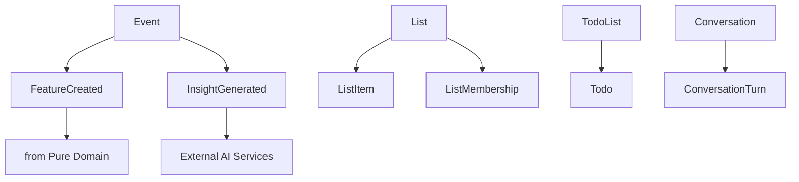

# Infrastructure Models

⚠️ **DDD Purity Warning**: Models in this layer support system operations and technical concerns. Full infrastructure dependencies acceptable.

**Last Updated**: September 18, 2025
**Source**: `services/domain/models.py`
**Models**: 8 total

## Overview

These models provide system capabilities and technical infrastructure support. They handle system events, user-created lists, task tracking, and conversation logging. These models are allowed full infrastructure dependencies as they exist to serve system operations rather than business logic.

**Architecture Rules**:
- ✅ System operations and technical concerns
- ✅ Full infrastructure dependencies acceptable
- ✅ Event tracking and system monitoring
- ✅ User interface support models
- ✅ Logging and audit trail capabilities
- ❌ NO business logic (belongs in domain layers)
- ❌ NO external system contracts (belongs in integration layer)

---

## Navigation

**By Business Function**:
- [Event Tracking](#event-tracking) - Event, FeatureCreated, InsightGenerated
- [List Management](#list-management) - List, ListItem, ListMembership
- [Task Tracking](#task-tracking) - Todo, TodoList
- [Conversation Logging](#conversation-logging) - Conversation, ConversationTurn

**All Models**: [Event](#event) | [FeatureCreated](#featurecreated) | [InsightGenerated](#insightgenerated) | [List](#list) | [ListItem](#listitem) | [ListMembership](#listmembership) | [Todo](#todo) | [TodoList](#todolist) | [Conversation](#conversation) | [ConversationTurn](#conversationturn)

---

## Event Tracking

### Event
**Purpose**: Base event class for system event tracking
**Layer**: Infrastructure Model
**Tags**: #system #events

**Field Structure**:
```python
# Identity fields
id: str                       # Unique identifier

# Core fields
type: str                     # Type of event
data: Dict[str, Any]          # Event payload data

# Context information
user_id: Optional[str]        # Associated user
session_id: Optional[str]     # Session identifier
correlation_id: Optional[str] # Request correlation ID

# System metadata
event_version: str            # Event schema version
processed: bool               # Event processed flag
processing_attempts: int      # Processing retry count

# Timing
timestamp: datetime           # When event occurred
processed_at: Optional[datetime] # When event was processed

# Metadata fields
created_at: datetime          # Creation timestamp
```

**Usage Pattern**:
```python
# Create system event
event = Event(
    type="user_action",
    data={
        "action": "feature_created",
        "feature_id": "feat-123",
        "feature_name": "OAuth2 Integration"
    },
    source="workflow_service",
    user_id="user-456",
    session_id="session-789",
    correlation_id="req-abc123",
    event_version="v1.0",
    processed=False,
    processing_attempts=0,
    timestamp=datetime.now()
)

# Process event
event.processed = True
event.processed_at = datetime.now()
event.processing_attempts += 1
```

**Cross-References**:
- Service: [EventService](../../services/event_service.md)
- Repository: [EventRepository](../../repositories/event_repository.md)
- Infrastructure: Event bus, message queues

### FeatureCreated
**Purpose**: Event triggered when a feature is created
**Layer**: Infrastructure Model
**Tags**: #system #events #pm

**Field Structure**:
```python
# Identity fields
id: str                       # Unique identifier

# Core fields (from base Event)
type: str = "feature.created"  # Event type
feature_id: str               # Created feature reference
created_by: str               # Who created the feature
source: str                   # Event source

# Metadata fields
created_at: datetime          # Event timestamp

# Relationships
feature: Optional["Feature"]  # Created feature
workflow: Optional["Workflow"] # Triggering workflow
```

**Usage Pattern**:
```python
# Create feature creation event
feature_event = FeatureCreated(
    feature_id="feat-123",
    created_by="user-456",
    source="workflow_service"
)

# Access inherited Event data
feature_event.data = {
    "feature_name": "OAuth2 Integration",
    "feature_description": "Implement OAuth2 authentication flow",
    "workflow_id": "workflow-202"
}
```

**Cross-References**:
- Service: [FeatureEventService](../../services/feature_event_service.md)
- Repository: [FeatureCreatedRepository](../../repositories/feature_created_repository.md)
- Related: [Pure Domain Feature](pure-domain.md#feature)
- Related: [Pure Domain Workflow](pure-domain.md#workflow)

### InsightGenerated
**Purpose**: Event for AI-generated insights
**Layer**: Infrastructure Model
**Tags**: #system #events #ai

**Field Structure**:
```python
# Identity fields
id: str                       # Unique identifier

# Core fields (from base Event)
type: str = "insight.generated" # Event type
insight: str                  # Generated insight text
confidence: float             # Insight confidence (0-1)
sources: List[str]            # Source references

# Metadata fields
created_at: datetime          # Generation timestamp

# Relationships
source_data: Optional[Dict[str, Any]] # Source data reference
```

**Usage Pattern**:
```python
# Create insight generation event
insight_event = InsightGenerated(
    insight="Based on recent feature requests, consider implementing rate limiting for API endpoints",
    confidence=0.87,
    sources=["analysis-456", "github_issues", "user_feedback"]
)

# Access inherited Event data for additional context
insight_event.data = {
    "insight_type": "security_recommendation",
    "features_analyzed": ["auth", "api", "user_mgmt"],
    "time_period": "last_30_days",
    "model_used": "gpt-4"
}
```

**Cross-References**:
- Service: [InsightService](../../services/insight_service.md)
- Repository: [InsightGeneratedRepository](../../repositories/insight_generated_repository.md)
- AI: Model integration, insight generation pipeline

---

## List Management

### List
**Purpose**: User-created list for organizing items
**Layer**: Infrastructure Model
**Tags**: #system #ui

**Field Structure**:
```python
# Identity fields
id: str                       # Unique identifier

# Core fields
name: str                     # List name
description: Optional[str]    # List description
list_type: str                # List type (todo, bookmark, reference)

# Ownership and access
owner_id: str                 # List owner
visibility: str               # Public, private, team
shared_with: List[str]        # User IDs with access

# Organization
category: Optional[str]       # List category
tags: List[str]               # List tags
color: Optional[str]          # Display color
icon: Optional[str]           # Display icon

# Content tracking
item_count: int               # Number of items
completed_count: int          # Completed items (if applicable)
last_activity: Optional[datetime] # Last activity timestamp

# Settings
allow_duplicates: bool        # Allow duplicate items
auto_sort: bool               # Auto-sort items
sort_order: str               # Sort order preference

# Metadata fields
created_at: datetime          # Creation timestamp
updated_at: datetime          # Last modification

# Relationships
items: List["ListItem"]       # List items
memberships: List["ListMembership"] # Access memberships
```

**Usage Pattern**:
```python
# Create user list
user_list = List(
    name="Authentication Research",
    description="Resources and tasks for OAuth2 implementation",
    list_type="reference",
    owner_id="user-456",
    visibility="team",
    shared_with=["user-789", "user-101"],
    category="research",
    tags=["oauth2", "security", "api"],
    color="#4CAF50",
    icon="security",
    item_count=0,
    completed_count=0,
    allow_duplicates=False,
    auto_sort=True,
    sort_order="priority_desc"
)

# Add items
item = ListItem(content="Review RFC 6749", item_type="task")
user_list.items.append(item)
user_list.item_count += 1
```

**Cross-References**:
- Service: [ListService](../../services/list_service.md)
- Repository: [ListRepository](../../repositories/list_repository.md)
- UI: List management interface

### ListItem
**Purpose**: Individual item within a user list
**Layer**: Infrastructure Model
**Tags**: #system #ui

**Field Structure**:
```python
# Identity fields
id: str                       # Unique identifier

# Core fields
list_id: str                  # Parent list reference
content: str                  # Item content/text
item_type: str                # Item type (task, link, note, reference)
position: int                 # Position within list

# Status tracking
completed: bool               # Completion status
priority: str                 # Priority level (high, medium, low)
status: str                   # Custom status

# Rich content
url: Optional[str]            # Associated URL
notes: Optional[str]          # Additional notes
metadata: Dict[str, Any]      # Item metadata

# Dates and deadlines
due_date: Optional[datetime]  # Due date (for tasks)
completed_at: Optional[datetime] # Completion timestamp
reminder_date: Optional[datetime] # Reminder date

# User tracking
created_by: str               # Who created the item
assigned_to: Optional[str]    # Who item is assigned to

# Metadata fields
created_at: datetime          # Creation timestamp
updated_at: datetime          # Last modification

# Relationships
list: Optional["List"]        # Parent list
```

**Usage Pattern**:
```python
# Create list item
list_item = ListItem(
    list_id="list-123",
    content="Implement OAuth2 callback endpoint",
    item_type="task",
    position=1,
    completed=False,
    priority="high",
    status="todo",
    url="https://github.com/company/auth/issues/45",
    notes="Remember to handle error cases and implement PKCE",
    metadata={
        "estimated_hours": 4,
        "skill_level": "intermediate",
        "dependencies": ["user_service_update"]
    },
    due_date=datetime.now() + timedelta(days=7),
    created_by="user-456",
    assigned_to="user-789"
)

# Complete item
list_item.completed = True
list_item.completed_at = datetime.now()
list_item.status = "done"
```

**Cross-References**:
- Service: [ListItemService](../../services/list_item_service.md)
- Repository: [ListItemRepository](../../repositories/list_item_repository.md)

### ListMembership
**Purpose**: Membership/access control for lists
**Layer**: Infrastructure Model
**Tags**: #system #access

**Field Structure**:
```python
# Identity fields
id: str                       # Unique identifier

# Core fields
list_id: str                  # List reference
user_id: str                  # User reference
role: str                     # Member role (owner, editor, viewer)

# Permissions
can_edit_items: bool          # Can edit list items
can_add_items: bool           # Can add new items
can_delete_items: bool        # Can delete items
can_share_list: bool          # Can share with others
can_manage_members: bool      # Can manage membership

# Invitation tracking
invited_by: Optional[str]     # Who sent invitation
invitation_accepted: bool     # Invitation accepted flag
invitation_sent_at: Optional[datetime] # Invitation timestamp
accepted_at: Optional[datetime] # Acceptance timestamp

# Activity tracking
last_activity: Optional[datetime] # Last activity in list
activity_count: int           # Activity count

# Notification preferences
email_notifications: bool     # Email notifications enabled
push_notifications: bool      # Push notifications enabled

# Metadata fields
created_at: datetime          # Membership creation
updated_at: datetime          # Last modification

# Relationships
list: Optional["List"]        # Associated list
user: Optional[Dict[str, Any]] # User reference
```

**Usage Pattern**:
```python
# Create list membership
membership = ListMembership(
    list_id="list-123",
    user_id="user-789",
    role="editor",
    can_edit_items=True,
    can_add_items=True,
    can_delete_items=False,
    can_share_list=False,
    can_manage_members=False,
    invited_by="user-456",
    invitation_accepted=True,
    invitation_sent_at=datetime.now() - timedelta(hours=2),
    accepted_at=datetime.now() - timedelta(hours=1),
    activity_count=0,
    email_notifications=True,
    push_notifications=False
)

# Update activity
membership.last_activity = datetime.now()
membership.activity_count += 1
```

**Cross-References**:
- Service: [ListMembershipService](../../services/list_membership_service.md)
- Repository: [ListMembershipRepository](../../repositories/list_membership_repository.md)
- Authentication: User permissions, access control

---

## Task Tracking

### Todo
**Purpose**: Individual todo item for task tracking
**Layer**: Infrastructure Model
**Tags**: #system #tasks

**Field Structure**:
```python
# Identity fields
id: str                       # Unique identifier

# Core fields
title: str                    # Todo title
description: Optional[str]    # Todo description
completed: bool               # Completion status
priority: str                 # Priority level

# Organization
category: Optional[str]       # Todo category
tags: List[str]               # Todo tags
todo_list_id: Optional[str]   # Parent todo list

# Scheduling
due_date: Optional[datetime]  # Due date
reminder_date: Optional[datetime] # Reminder date
estimated_duration: Optional[int] # Estimated minutes

# Progress tracking
progress_percentage: int      # Progress (0-100)
time_spent: Optional[int]     # Time spent in minutes
completed_at: Optional[datetime] # Completion timestamp

# Context
context: Dict[str, Any]       # Additional context
related_items: List[str]      # Related item references

# User tracking
created_by: str               # Creator
assigned_to: Optional[str]    # Assignee

# Metadata fields
created_at: datetime          # Creation timestamp
updated_at: datetime          # Last modification

# Relationships
todo_list: Optional["TodoList"] # Parent todo list
```

**Usage Pattern**:
```python
# Create todo item
todo = Todo(
    title="Review OAuth2 security considerations",
    description="Review the security implications of the current OAuth2 implementation",
    completed=False,
    priority="high",
    category="security_review",
    tags=["oauth2", "security", "review"],
    due_date=datetime.now() + timedelta(days=3),
    reminder_date=datetime.now() + timedelta(days=2),
    estimated_duration=120,  # 2 hours
    progress_percentage=0,
    context={
        "related_feature": "feat-123",
        "review_type": "security",
        "documentation_needed": True
    },
    related_items=["feat-123", "doc-456"],
    created_by="user-456",
    assigned_to="user-789"
)

# Update progress
todo.progress_percentage = 50
todo.time_spent = 60  # 1 hour spent
todo.updated_at = datetime.now()

# Complete todo
todo.completed = True
todo.completed_at = datetime.now()
todo.progress_percentage = 100
```

**Cross-References**:
- Service: [todo_knowledge_service.py](../../services/todo/todo_knowledge_service.py)
- Repository: [todo_repository.py](../../services/repositories/todo_repository.py)
- API: [todo_management.py](../../services/api/todo_management.py)

### TodoList
**Purpose**: Collection of todos for organization
**Layer**: Infrastructure Model
**Tags**: #system #tasks

**Field Structure**:
```python
# Identity fields
id: str                       # Unique identifier

# Core fields
name: str                     # Todo list name
description: Optional[str]    # List description
list_type: str                # List type (personal, project, team)

# Organization
category: Optional[str]       # List category
color: Optional[str]          # Display color
icon: Optional[str]           # Display icon

# Ownership and sharing
owner_id: str                 # List owner
shared_with: List[str]        # Shared user IDs
visibility: str               # Private, team, public

# Content tracking
total_todos: int              # Total todo count
completed_todos: int          # Completed todo count
progress_percentage: float    # Overall progress

# Settings
auto_archive_completed: bool  # Auto-archive setting
sort_order: str               # Default sort order
default_priority: str         # Default priority for new todos

# Activity tracking
last_activity: Optional[datetime] # Last activity
activity_count: int           # Activity count

# Metadata fields
created_at: datetime          # Creation timestamp
updated_at: datetime          # Last modification

# Relationships
todos: List["Todo"]           # Todo items in list
```

**Usage Pattern**:
```python
# Create todo list
todo_list = TodoList(
    name="OAuth2 Implementation Tasks",
    description="All tasks related to implementing OAuth2 authentication",
    list_type="project",
    category="feature_development",
    color="#2196F3",
    icon="security",
    owner_id="user-456",
    shared_with=["user-789", "user-101"],
    visibility="team",
    total_todos=0,
    completed_todos=0,
    progress_percentage=0.0,
    auto_archive_completed=True,
    sort_order="priority_desc",
    default_priority="medium",
    activity_count=0
)

# Add todos
todo = Todo(title="Implement callback endpoint")
todo_list.todos.append(todo)
todo_list.total_todos += 1

# Update progress
todo_list.completed_todos += 1
todo_list.progress_percentage = (todo_list.completed_todos / todo_list.total_todos) * 100
todo_list.last_activity = datetime.now()
todo_list.activity_count += 1
```

**Cross-References**:
- Service: [todo_knowledge_service.py](../../services/todo/todo_knowledge_service.py)
- Repository: [universal_list_repository.py](../../services/repositories/universal_list_repository.py)

---

## Conversation Logging

### Conversation
**Purpose**: A conversation session between user and AI
**Layer**: Infrastructure Model
**Tags**: #system #conversation

**Field Structure**:
```python
# Identity fields
id: str                       # Unique identifier

# Core fields
title: str                    # Conversation title
conversation_type: str        # Type of conversation
status: str                   # Conversation status (active, completed, archived)

# Participants
user_id: str                  # User participant
ai_model: str                 # AI model used
ai_version: str               # AI model version

# Content tracking
turn_count: int               # Number of conversation turns
total_tokens: Optional[int]   # Total tokens used
estimated_cost: Optional[float] # Estimated conversation cost

# Context information
context_data: Dict[str, Any]  # Conversation context
tags: List[str]               # Conversation tags
category: Optional[str]       # Conversation category

# Session tracking
session_id: Optional[str]     # Session identifier
started_at: datetime          # Conversation start
ended_at: Optional[datetime]  # Conversation end
duration_minutes: Optional[int] # Duration in minutes

# Quality tracking
user_satisfaction: Optional[float] # User satisfaction (0-1)
resolution_status: str        # Issue resolution status
feedback: Optional[str]       # User feedback

# Metadata fields
created_at: datetime          # Creation timestamp
updated_at: datetime          # Last modification

# Relationships
turns: List["ConversationTurn"] # Conversation turns
```

**Usage Pattern**:
```python
# Create conversation
conversation = Conversation(
    title="OAuth2 Implementation Help",
    conversation_type="feature_assistance",
    status="active",
    user_id="user-456",
    ai_model="claude-3-sonnet",
    ai_version="20240229",
    turn_count=0,
    context_data={
        "feature_id": "feat-123",
        "project_id": "proj-789",
        "previous_context": "user_needs_oauth2_help"
    },
    tags=["oauth2", "implementation", "help"],
    category="technical_assistance",
    session_id="session-abc123",
    started_at=datetime.now(),
    resolution_status="in_progress"
)

# Add conversation turns
turn = ConversationTurn(
    conversation_id=conversation.id,
    turn_number=1,
    speaker="user",
    content="I need help implementing OAuth2 in my application"
)
conversation.turns.append(turn)
conversation.turn_count += 1

# End conversation
conversation.ended_at = datetime.now()
conversation.status = "completed"
conversation.duration_minutes = 45
conversation.user_satisfaction = 0.9
conversation.resolution_status = "resolved"
```

**Cross-References**:
- Service: [ConversationService](../../services/conversation_service.md)
- Repository: [ConversationRepository](../../repositories/conversation_repository.md)
- AI: Conversation management, model tracking

### ConversationTurn
**Purpose**: A single turn/exchange in a conversation
**Layer**: Infrastructure Model
**Tags**: #system #conversation

**Field Structure**:
```python
# Identity fields
id: str                       # Unique identifier

# Core fields
conversation_id: str          # Parent conversation reference
turn_number: int              # Turn sequence number
speaker: str                  # Who spoke (user, ai, system)
content: str                  # Turn content/message

# Metadata
message_type: str             # Message type (text, code, image, etc.)
language: Optional[str]       # Content language
token_count: Optional[int]    # Token count for this turn

# AI-specific fields (when speaker is AI)
model_used: Optional[str]     # AI model used
generation_params: Optional[Dict[str, Any]] # Generation parameters
confidence_score: Optional[float] # Response confidence
response_time_ms: Optional[int] # Response generation time

# Context and references
context_refs: List[str]       # Referenced context items
tool_calls: List[Dict[str, Any]] # Tool calls made
attachments: List[str]        # Attached files/resources

# Quality metrics
helpful_rating: Optional[int] # Helpfulness rating (1-5)
accuracy_rating: Optional[int] # Accuracy rating (1-5)
user_feedback: Optional[str]  # User feedback on turn

# Processing flags
processed: bool               # Turn processed flag
error_occurred: bool          # Error during processing
error_message: Optional[str]  # Error details

# Metadata fields
created_at: datetime          # Turn timestamp

# Relationships
conversation: Optional["Conversation"] # Parent conversation
```

**Usage Pattern**:
```python
# Create user turn
user_turn = ConversationTurn(
    conversation_id="conv-123",
    turn_number=1,
    speaker="user",
    content="I need help implementing OAuth2 in my application",
    message_type="text",
    language="en",
    context_refs=["feat-123", "proj-789"],
    processed=True,
    error_occurred=False
)

# Create AI response turn
ai_turn = ConversationTurn(
    conversation_id="conv-123",
    turn_number=2,
    speaker="ai",
    content="I'll help you implement OAuth2. Let me start by understanding your requirements...",
    message_type="text",
    language="en",
    token_count=150,
    model_used="claude-3-sonnet",
    generation_params={
        "temperature": 0.7,
        "max_tokens": 2000
    },
    confidence_score=0.92,
    response_time_ms=1200,
    tool_calls=[
        {
            "tool": "search_docs",
            "parameters": {"query": "oauth2 implementation"}
        }
    ],
    processed=True,
    error_occurred=False
)

# Add user feedback
ai_turn.helpful_rating = 5
ai_turn.accuracy_rating = 4
ai_turn.user_feedback = "Very helpful response, clear next steps"
```

**Cross-References**:
- Service: [ConversationTurnService](../../services/conversation_turn_service.md)
- Repository: [ConversationTurnRepository](../../repositories/conversation_turn_repository.md)

---

## Model Relationships



---

## Architecture Patterns

### System Event Tracking
Infrastructure models provide comprehensive event tracking:

- **Event**: Base event model for all system events
- **FeatureCreated**: Specific business events with rich context
- **InsightGenerated**: AI-generated events with quality metrics

### User Interface Support
Models supporting user interface functionality:

- **List/ListItem**: User-created lists with rich metadata
- **Todo/TodoList**: Task management with progress tracking
- **ListMembership**: Access control and collaboration

### Audit and Logging
Comprehensive logging for system operations:

- **Conversation/ConversationTurn**: Full conversation logging
- **Event processing**: Status tracking and retry mechanisms
- **Activity tracking**: User activity across all models

### Infrastructure Integration
Full infrastructure integration patterns:

- Database persistence with complex queries
- Caching strategies for performance
- Event bus integration for real-time updates
- Notification systems for user engagement

---

## Usage Guidelines

### For Developers
1. **Use for system concerns only** - Don't put business logic in infrastructure models
2. **Leverage full infrastructure** - These models can use any system capabilities
3. **Include comprehensive tracking** - Add activity, error, and performance metrics
4. **Design for observability** - Include logging and monitoring capabilities

### For Architects
1. **Separate from business logic** - Ensure clear separation from domain concerns
2. **Plan for scale** - Infrastructure models will handle high volume
3. **Consider performance** - Optimize for system operations and queries
4. **Enable monitoring** - Build observability into infrastructure patterns

---

## Related Documentation

- **[Hub Navigation](../models-architecture.md)** - Return to main navigation
- **[Pure Domain Models](pure-domain.md)** - Core business concepts
- **[Supporting Domain Models](supporting-domain.md)** - Business with data structures
- **[Integration Models](integration.md)** - External system contracts
- **[Dependency Diagrams](../dependency-diagrams.md)** - Visual model relationships

---

**Status**: ✅ **CURRENT** - All infrastructure models documented with complete field definitions and system context
