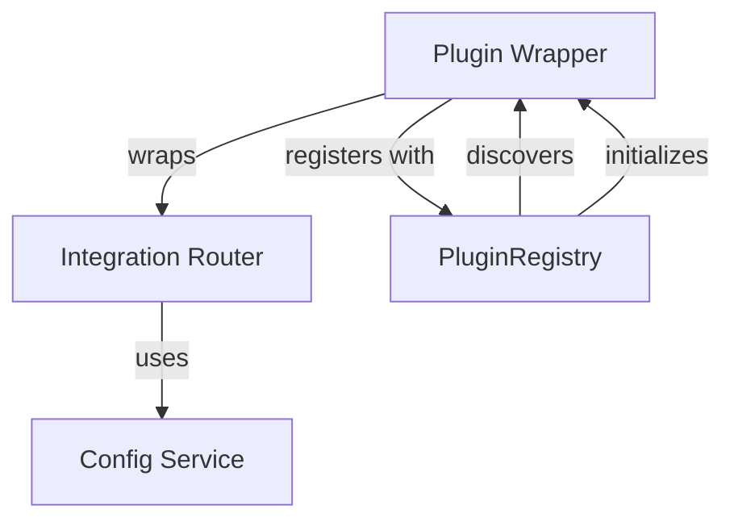

# Plugin Wrapper Pattern

**Status**: Active
**Last Updated**: October 4, 2025
**Author**: Piper Morgan Team

## Overview

Piper Morgan's plugin system uses the Adapter/Wrapper pattern where plugins are thin wrappers (~100 lines) around integration routers that contain business logic.

## Pattern Description

### Three-Layer Architecture



**Layers**:

1. **Plugin Wrapper** - Implements PiperPlugin interface, handles lifecycle
2. **Integration Router** - Contains business logic, FastAPI routes
3. **Config Service** - Manages integration-specific configuration

### File Structure

Each integration follows this pattern:

```
services/integrations/[name]/
├── __init__.py
├── [name]_integration_router.py  # Business logic (~300-500 lines)
├── [name]_plugin.py               # Thin wrapper (~100 lines)
├── config_service.py              # Config management (~150 lines)
└── tests/
```

## Why This Pattern?

### Separation of Concerns

- **Plugin Layer**: Protocol compliance, lifecycle management
- **Router Layer**: Business logic, API routes
- **Config Layer**: Configuration, validation

### Benefits

1. **Clear Boundaries**: Interface between plugin system and business logic
2. **Gradual Migration**: Business logic can move to plugins later if needed
3. **Testing Simplicity**: Test routers and plugins independently
4. **Maintenance**: Changes to plugin protocol don't affect business logic
5. **Flexibility**: Routers can exist without plugins during development

### Trade-offs

**Advantages**:

- Clean separation of concerns
- Easy to understand and maintain
- Supports incremental adoption
- Minimal coupling

**Disadvantages**:

- Two-file structure per integration (slight overhead)
- Additional abstraction layer
- Router+Plugin coupling (though loose)

## Pattern Examples

### Example: Slack Plugin Structure

**Router** (`slack_integration_router.py`):

```python
class SlackIntegrationRouter:
    """Business logic for Slack integration"""

    def __init__(self, config_service: SlackConfigService):
        self.config = config_service
        self.router = APIRouter(prefix="/api/integrations/slack")
        self._setup_routes()

    def _setup_routes(self):
        @self.router.post("/webhook")
        async def handle_webhook(request: Request):
            # Business logic here
            pass
```

**Plugin** (`slack_plugin.py`):

```python
class SlackPlugin(PiperPlugin):
    """Thin wrapper implementing PiperPlugin interface"""

    def __init__(self):
        self.config_service = SlackConfigService()
        self.router_instance = SlackIntegrationRouter(self.config_service)

    def get_router(self) -> APIRouter:
        return self.router_instance.router

    # Other PiperPlugin interface methods...
```

## Implementation Guidelines

### Creating a New Integration

1. **Start with Router**: Implement business logic first
2. **Add Config Service**: Following standard pattern
3. **Wrap with Plugin**: Implement PiperPlugin interface
4. **Register**: Auto-registration via module import
5. **Configure**: Add to PIPER.user.md

### When to Use This Pattern

**Use this pattern when**:

- Adding new external integrations
- Need lifecycle management
- Want discovery and config control
- Integration has routes/webhooks

**Don't use this pattern for**:

- Internal utilities (use services/ directly)
- One-off scripts
- Core system components

### Versioning Your Plugin

All plugins must specify a version using [Semantic Versioning](https://semver.org/):

```python
def get_metadata(self) -> PluginMetadata:
    return PluginMetadata(
        name="your_integration",
        version="1.0.0",  # MAJOR.MINOR.PATCH
        # ...
    )
```

See [Plugin Versioning Policy](../../../../guides/plugin-versioning-policy.md) for details on when to increment versions.

## Migration Path

If future needs require moving business logic into plugins:

1. **Phase 1**: Move router methods into plugin class
2. **Phase 2**: Update tests to use plugin directly
3. **Phase 3**: Remove router file, update imports
4. **Phase 4**: Update documentation

This migration is intentionally easy - the wrapper pattern supports it naturally.

## Related Patterns

- **Adapter Pattern**: Wrapper adapts router to plugin interface
- **Facade Pattern**: Plugin presents simple interface to complex router
- **Proxy Pattern**: Plugin controls access to router

## References

- [Plugin Interface Definition](../../../services/plugins/plugin_interface.py)
- [Plugin Registry](../../../services/plugins/plugin_registry.py)
- [Plugin Development Guide](../../../../guides/plugin-development-guide.md) - Practical tutorial
- [Plugin System README](../../../../../services/plugins/README.md)

---

_This pattern was established in GREAT-3A (October 2025) and documented in GREAT-3C._
