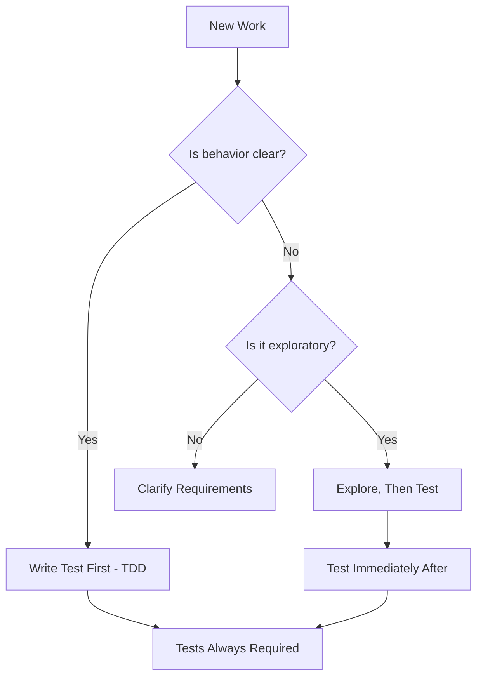

# TDD Guidance - Pragmatic Approach

## Our Testing Philosophy

### Core Principle: Testing is Mandatory, TDD is Preferred

We have a **strong bias toward TDD** but recognize pragmatic exceptions. Here's how to decide:

---

## When to Use Strict TDD (Write Test First)

### Use TDD When:
- **Building new functionality** - Test defines the contract
- **Fixing bugs** - Test prevents regression
- **Complex logic** - Test clarifies requirements
- **Integration points** - Test ensures compatibility
- **Domain logic** - Test preserves business rules
- **User-facing features** - Test validates experience

### Example TDD Flow:
```python
# 1. Write failing test FIRST
def test_morning_standup_returns_five_questions():
    result = morning_standup()
    assert len(result.questions) == 5
    # FAILS - function doesn't exist yet

# 2. Implement minimal solution
def morning_standup():
    return StandupResult(questions=[...])
    
# 3. Test passes - feature complete
```

---

## When TDD May Not Be Required

### Pragmatic Exceptions:
1. **Exploratory spikes** - Learning what's possible
2. **UI prototypes** - Visual iteration needed
3. **External integration discovery** - API behavior unknown
4. **Emergency hotfixes** - Production on fire
5. **Configuration changes** - Non-logic modifications
6. **Documentation updates** - No executable code

### BUT: Test Must Follow Immediately
Even when not doing TDD, tests are written immediately after:
```python
# Explored approach first, then:
# Write test to lock in the behavior
def test_spike_became_feature():
    # Test what you discovered works
    assert spike_solution() == expected_behavior
```

---

## The Decision Framework



---

## Testing Requirements Regardless of Approach

### Minimum Test Coverage
Whether TDD or test-after, every feature needs:
- **Happy path test** - Normal operation
- **Error case test** - Failure handling  
- **Edge case test** - Boundary conditions
- **Integration test** - Works with system

### Evidence Requirements
```bash
# Always show test results
pytest tests/test_feature.py -v
# Output required as evidence
```

---

## Gameplan Template Addition

### Phase 1: Test Strategy (Choose Approach)

#### Option A: TDD (Preferred)
```markdown
- [ ] Write failing test for requirement
- [ ] Implement minimal solution
- [ ] Verify test passes
- [ ] Refactor if needed
```

#### Option B: Exploratory Then Test
```markdown
- [ ] Explore solution approach
- [ ] Document discoveries
- [ ] Write comprehensive tests
- [ ] Verify coverage complete
```

**Justification Required for Option B**: [Why TDD not appropriate]

---

## Agent-Specific Guidance

### For Claude Code
- Can explore broadly when discovering patterns
- Must test findings immediately after discovery
- TDD for any production code

### For Cursor  
- TDD for all feature implementation
- Test-after allowed for UI adjustments
- Always verify with integration tests

---

## The Pragmatic Balance

We optimize for:
1. **Confidence** - Tests ensure quality
2. **Velocity** - Pragmatic choices when appropriate
3. **Learning** - Exploration when needed
4. **Discipline** - Tests always required

Not:
- Dogma that slows discovery
- Untested code that breaks later
- Process theater without value

---

*The goal: Maximum quality with pragmatic flexibility*